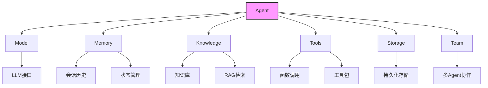
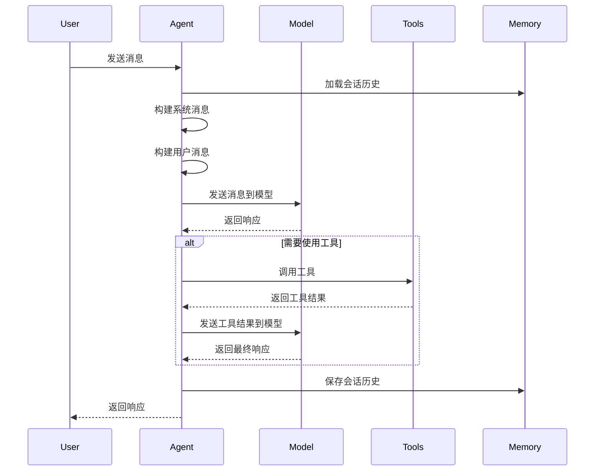

# Agent 概述

Agent是Agno框架的核心组件，它提供了一个灵活的接口，用于创建和管理基于大型语言模型(LLM)的智能代理。

## Agent的主要组件

## Agent的主要功能

1. **模型交互**: 与各种LLM（如OpenAI、Anthropic等）进行交互
2. **记忆管理**: 维护会话历史和状态
3. **知识检索**: 通过RAG（检索增强生成）访问知识库
4. **工具使用**: 调用各种工具和函数
5. **推理能力**: 通过step-by-step推理解决复杂问题
6. **团队协作**: 多个Agent协同工作
7. **会话管理**: 创建、保存和加载会话

## Agent的基本使用流程

Agent的设计理念是提供一个灵活、可扩展的框架，使开发者能够轻松创建各种智能代理应用。 