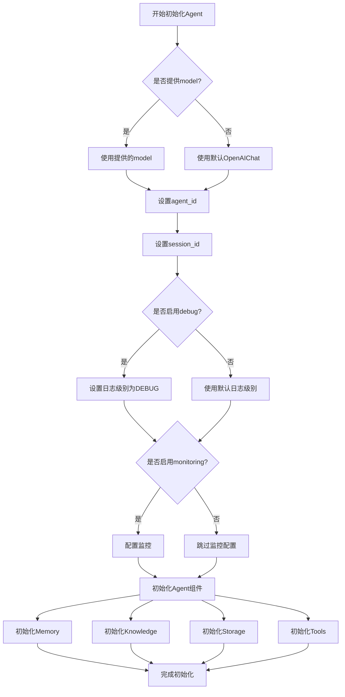
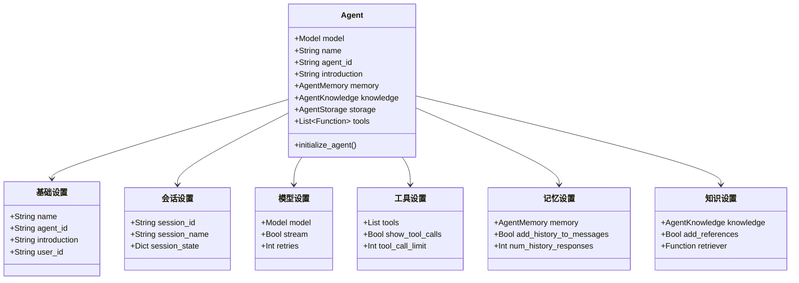

# Agent 初始化流程

Agent的初始化是创建智能代理的第一步，这个过程涉及多个组件的配置和初始化。

## 初始化流程图



## 初始化参数分类



## 初始化代码示例

```python
from agno.agent import Agent
from agno.models.openai import OpenAIChat

# 创建一个基本的Agent
agent = Agent(
    model=OpenAIChat(model="gpt-4"),
    name="助手",
    description="一个有用的AI助手",
    instructions=["回答用户问题", "提供有用的信息"]
)

# 使用工具的Agent
agent = Agent(
    model=OpenAIChat(model="gpt-4"),
    name="计算助手",
    tools=[calculator_tool, weather_tool],
    show_tool_calls=True
)

# 带有知识库的Agent
agent = Agent(
    model=OpenAIChat(model="gpt-4"),
    name="知识助手",
    knowledge=my_knowledge_base,
    add_references=True
)
```

初始化过程中，Agent会自动设置必要的ID、配置模型、准备工具，并建立内存和存储系统，为后续的交互做好准备。 