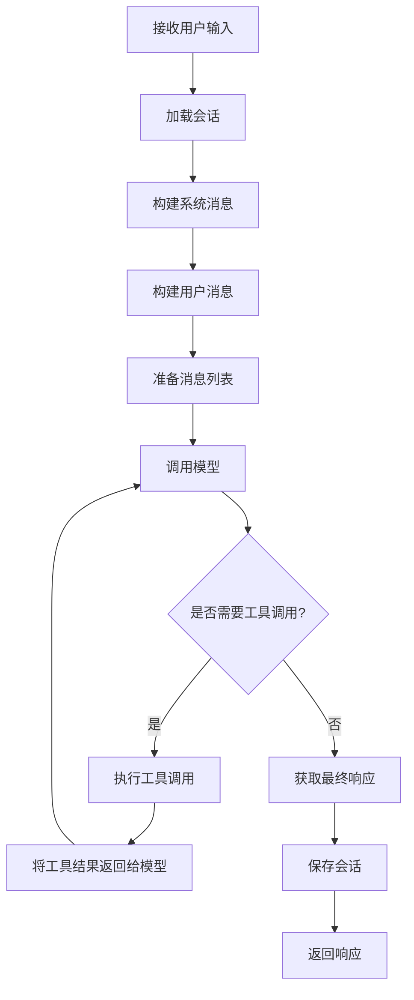
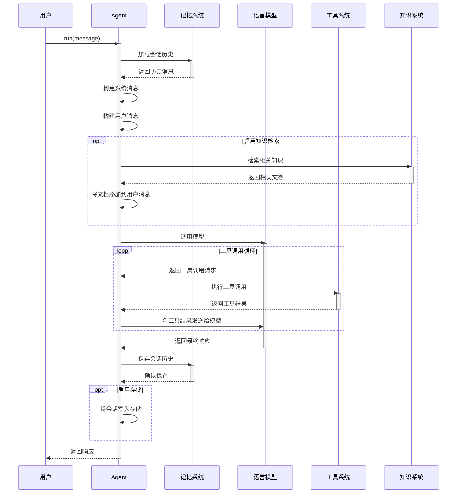
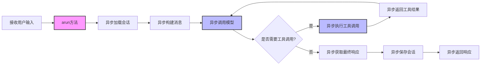
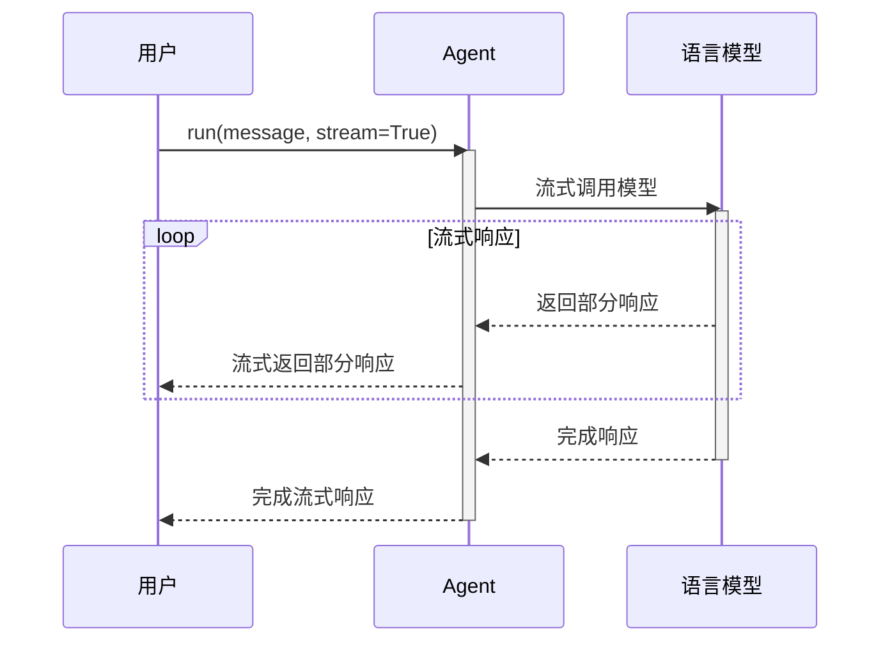
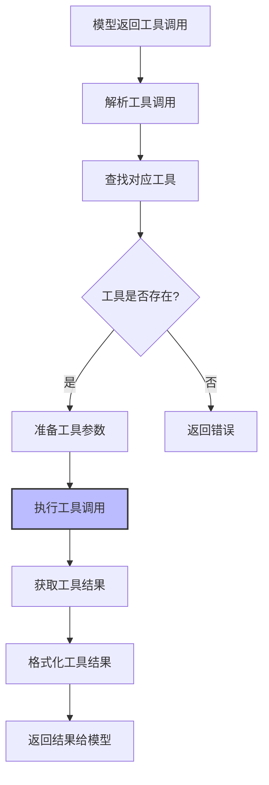

# Agent 运行流程

Agent的运行流程是指从接收用户输入到生成最终响应的整个过程。这个过程涉及消息处理、模型调用、工具使用等多个环节。

## 基本运行流程

```mermaid
flowchart TD
    A[接收用户输入] --> B[加载会话]
    B --> C[构建系统消息]
    C --> D[构建用户消息]
    D --> E[准备消息列表]
    E --> F[调用模型]
    
    F --> G{是否需要工具调用?}
    G -->|是| H[执行工具调用]
    H --> I[将工具结果返回给模型]
    I --> F
    
    G -->|否| J[获取最终响应]
    J --> K[保存会话]
    K --> L[返回响应]
```

## 详细运行流程

```mermaid
sequenceDiagram
    participant User as 用户
    participant Agent as Agent
    participant Memory as 记忆系统
    participant Model as 语言模型
    participant Tools as 工具系统
    participant Knowledge as 知识系统
    
    User->>Agent: run(message)
    activate Agent
    
    Agent->>Memory: 加载会话历史
    activate Memory
    Memory-->>Agent: 返回历史消息
    deactivate Memory
    
    Agent->>Agent: 构建系统消息
    Agent->>Agent: 构建用户消息
    
    opt 启用知识检索
        Agent->>Knowledge: 检索相关知识
        activate Knowledge
        Knowledge-->>Agent: 返回相关文档
        deactivate Knowledge
        Agent->>Agent: 将文档添加到用户消息
    end
    
    Agent->>Model: 调用模型
    activate Model
    
    loop 工具调用循环
        Model-->>Agent: 返回工具调用请求
        Agent->>Tools: 执行工具调用
        activate Tools
        Tools-->>Agent: 返回工具结果
        deactivate Tools
        Agent->>Model: 将工具结果发送给模型
    end
    
    Model-->>Agent: 返回最终响应
    deactivate Model
    
    Agent->>Memory: 保存会话历史
    activate Memory
    Memory-->>Agent: 确认保存
    deactivate Memory
    
    opt 启用存储
        Agent->>Agent: 将会话写入存储
    end
    
    Agent-->>User: 返回响应
    deactivate Agent
```

## 异步运行流程

```mermaid
flowchart LR
    A[接收用户输入] --> B[arun方法]
    B --> C[异步加载会话]
    C --> D[异步构建消息]
    D --> E[异步调用模型]
    
    E --> F{是否需要工具调用?}
    F -->|是| G[异步执行工具调用]
    G --> H[异步返回工具结果]
    H --> E
    
    F -->|否| I[异步获取最终响应]
    I --> J[异步保存会话]
    J --> K[异步返回响应]
    
    style B fill:#f9f,stroke:#333,stroke-width:2px
    style E fill:#bbf,stroke:#333,stroke-width:2px
    style G fill:#bbf,stroke:#333,stroke-width:2px
```

## 流式响应处理

```mermaid
sequenceDiagram
    participant User as 用户
    participant Agent as Agent
    participant Model as 语言模型
    
    User->>Agent: run(message, stream=True)
    activate Agent
    
    Agent->>Model: 流式调用模型
    activate Model
    
    loop 流式响应
        Model-->>Agent: 返回部分响应
        Agent-->>User: 流式返回部分响应
    end
    
    Model-->>Agent: 完成响应
    deactivate Model
    
    Agent-->>User: 完成流式响应
    deactivate Agent
```

## 工具调用流程

```mermaid
flowchart TD
    A[模型返回工具调用] --> B[解析工具调用]
    B --> C[查找对应工具]
    C --> D{工具是否存在?}
    
    D -->|是| E[准备工具参数]
    D -->|否| F[返回错误]
    
    E --> G[执行工具调用]
    G --> H[获取工具结果]
    H --> I[格式化工具结果]
    I --> J[返回结果给模型]
    
    style G fill:#bbf,stroke:#333,stroke-width:2px
```

Agent的运行流程设计灵活，可以处理同步和异步调用，支持流式响应，并能够处理复杂的工具调用逻辑。 