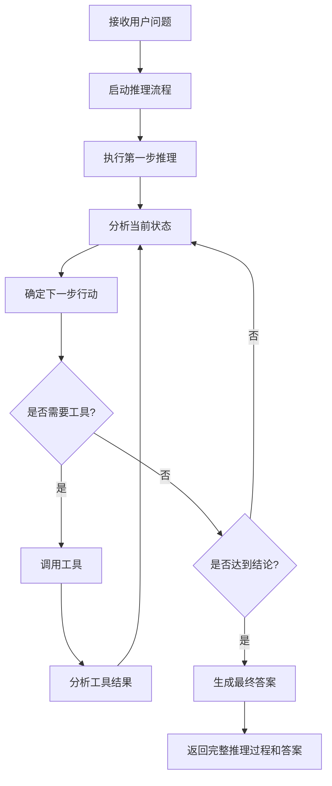
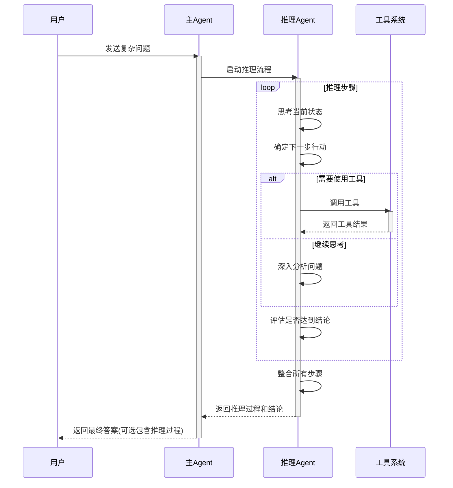
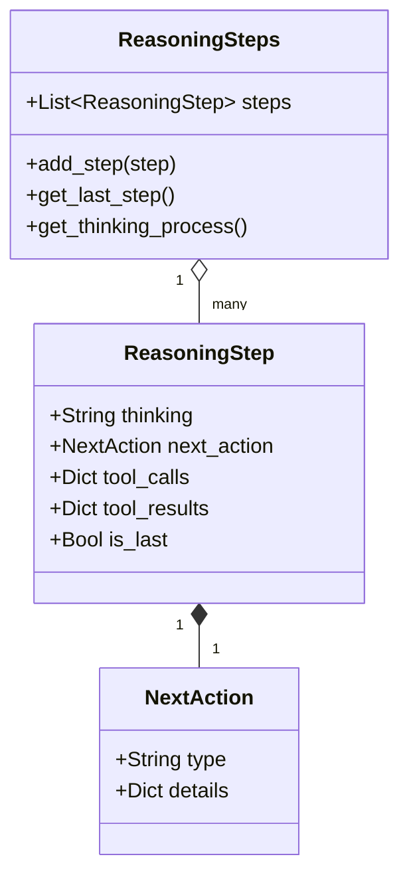
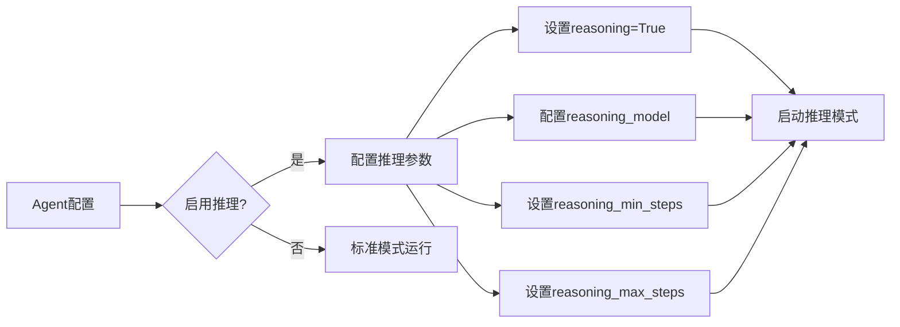

# Agent 推理功能

Agent的推理功能允许它通过多步骤思考来解决复杂问题，这是一种类似于人类思考的方式，可以提高Agent的问题解决能力。

## 推理流程概述



## 推理步骤详解



## 推理步骤数据结构



## 推理模式配置



## 推理示例代码

```python
from agno.agent import Agent
from agno.models.openai import OpenAIChat

# 创建一个启用推理功能的Agent
agent = Agent(
    model=OpenAIChat(model="gpt-4"),
    name="推理助手",
    reasoning=True,  # 启用推理功能
    reasoning_min_steps=1,  # 最少推理步骤
    reasoning_max_steps=5,  # 最多推理步骤
    # 可以指定不同的推理模型
    reasoning_model=OpenAIChat(model="gpt-4"),
    # 显示推理过程
    show_reasoning=True
)

# 使用推理功能解决问题
response = agent.run("解决这个复杂的数学问题: 如果一个圆的周长是10π，那么它的面积是多少?")
```

推理功能使Agent能够像人类一样逐步思考问题，特别适合解决需要多步骤分析的复杂任务，如数学问题、逻辑推理、规划等。 