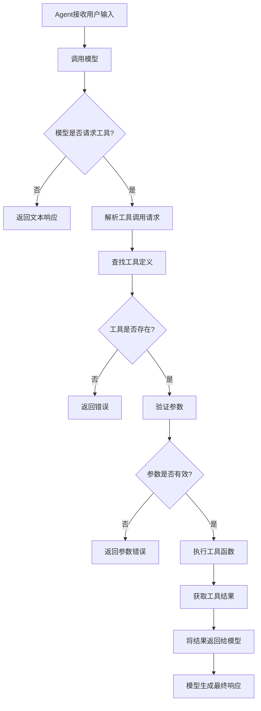
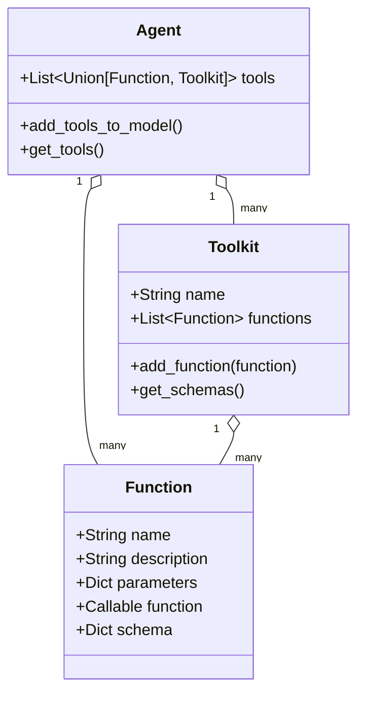
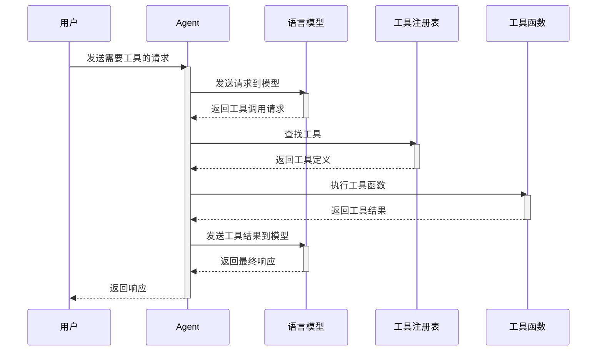
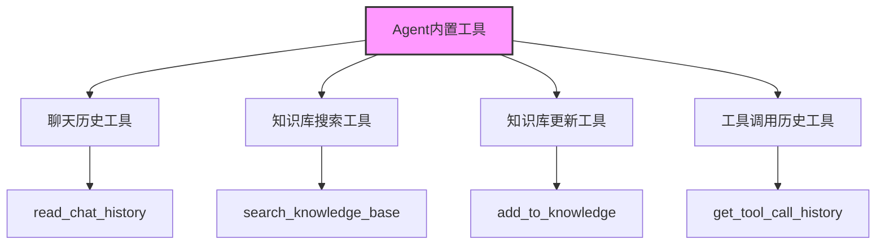
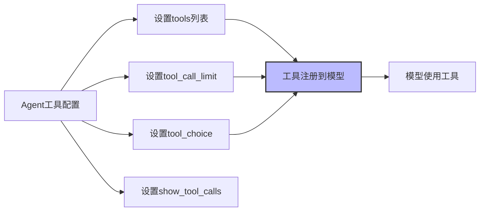

# Agent 工具使用

Agent的工具使用功能允许它调用外部函数来执行各种任务，极大地扩展了Agent的能力范围。工具可以是任何Python函数，从简单的计算到复杂的API调用。

## 工具调用流程



## 工具定义和注册



## 工具调用序列图



## 内置工具类型



## 工具定义示例

```python
from agno.agent import Agent
from agno.tools.function import Function

# 定义一个简单的计算器工具
def calculator(expression: str) -> float:
    """计算数学表达式的结果"""
    return eval(expression)

# 将函数转换为工具
calculator_tool = Function(
    name="calculator",
    description="计算数学表达式的结果",
    parameters={
        "type": "object",
        "properties": {
            "expression": {
                "type": "string",
                "description": "要计算的数学表达式，如 '2 + 2' 或 '3 * 4'"
            }
        },
        "required": ["expression"]
    },
    function=calculator
)

# 创建使用该工具的Agent
agent = Agent(
    name="计算助手",
    tools=[calculator_tool],
    show_tool_calls=True  # 在响应中显示工具调用
)

# 使用工具
response = agent.run("计算 (15 * 7) + (22 / 2) 的结果")
```

## 工具调用限制配置



工具使用功能使Agent能够与外部世界交互，执行各种任务，从而大大增强了其实用性和功能范围。通过合理配置工具，可以创建出功能强大的专业Agent。 