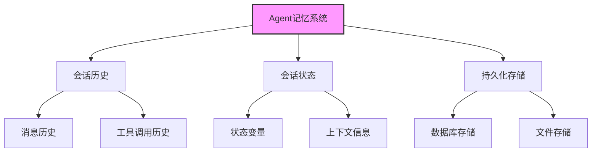
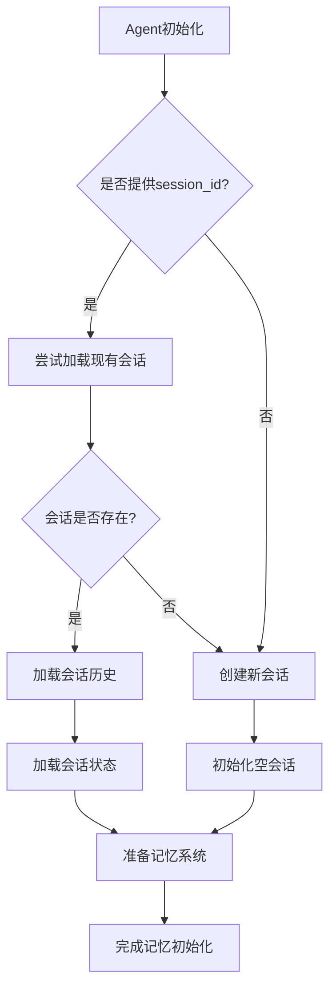
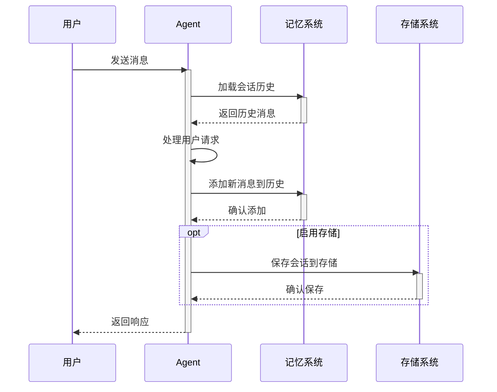
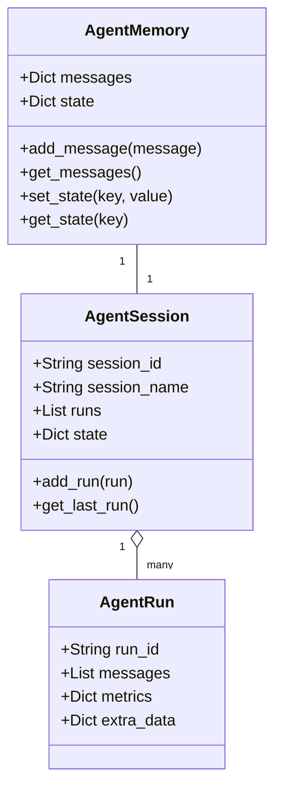
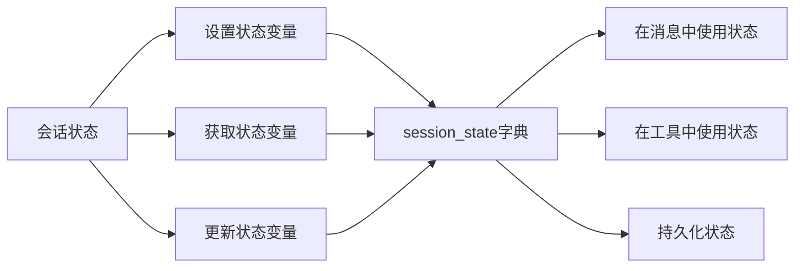

# Agent 记忆系统

Agent的记忆系统允许它存储和检索过去的交互历史，维护会话状态，并在多次交互中保持上下文连贯性。

## 记忆系统架构



## 记忆加载流程



## 记忆使用流程



## 记忆数据结构



## 会话状态管理



## 记忆系统代码示例

```python
from agno.agent import Agent
from agno.memory.agent import AgentMemory
from agno.storage.agent.sqlite import SQLiteAgentStorage

# 创建带有持久化存储的Agent
agent = Agent(
    name="记忆助手",
    # 配置存储
    storage=SQLiteAgentStorage(db_path="agent_sessions.db"),
    # 启用会话状态
    session_state={"counter": 0},
    # 在消息中使用状态变量
    add_state_in_messages=True
)

# 首次运行
response = agent.run("你好，这是我们第一次对话")

# 更新状态
agent.session_state["counter"] = 1
agent.session_state["user_name"] = "张三"

# 再次运行，会保持会话上下文
response = agent.run("你还记得我们之前聊了什么吗?")

# 保存会话ID以便未来恢复
session_id = agent.session_id

# 稍后恢复会话
restored_agent = Agent(
    name="记忆助手",
    storage=SQLiteAgentStorage(db_path="agent_sessions.db"),
    session_id=session_id  # 提供之前的会话ID
)

# 继续之前的对话
response = restored_agent.run("继续我们之前的对话")
```

记忆系统是Agent长期交互的基础，它使Agent能够记住过去的对话，维护状态，并在多次交互中提供连贯的体验。 