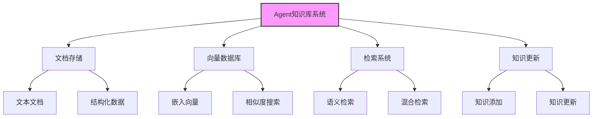
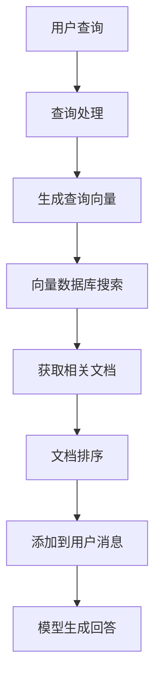
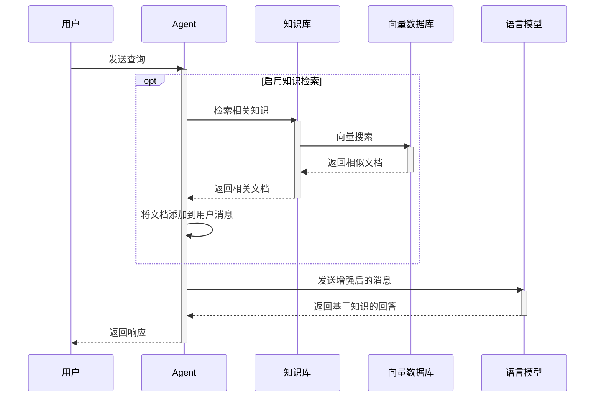
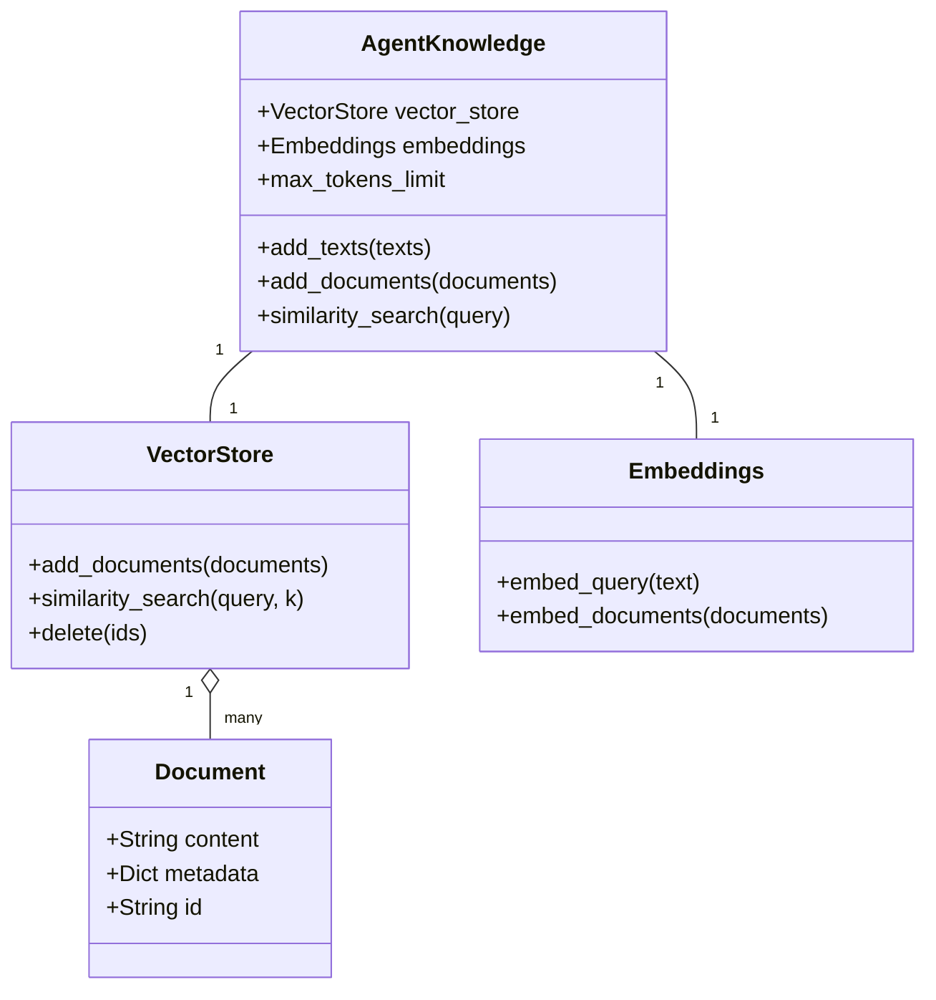
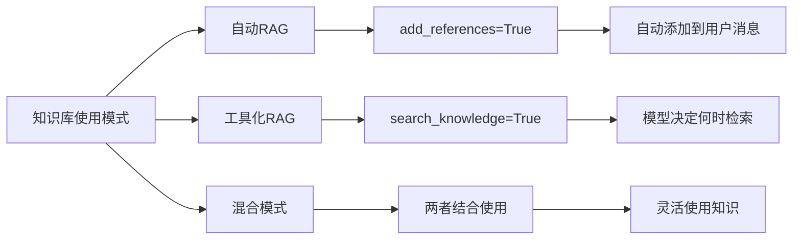
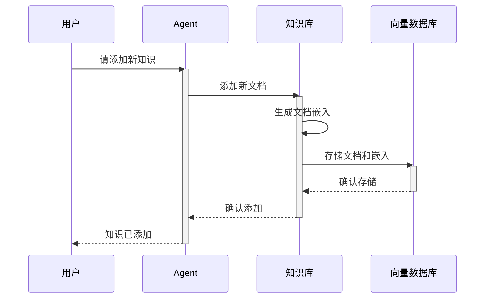

# Agent 知识库系统

Agent的知识库系统允许它访问和利用外部知识，通过检索增强生成(RAG)技术提高回答的准确性和相关性。

## 知识库系统架构



## RAG检索流程



## 知识检索序列图



## 知识库数据结构



## 知识库使用模式



## 知识库代码示例

```python
from agno.agent import Agent
from agno.knowledge.agent import AgentKnowledge
from agno.knowledge.vector_stores import ChromaVectorStore
from agno.knowledge.embeddings import OpenAIEmbeddings

# 创建知识库
knowledge = AgentKnowledge(
    vector_store=ChromaVectorStore(collection_name="my_docs"),
    embeddings=OpenAIEmbeddings()
)

# 添加文档到知识库
knowledge.add_texts([
    "人工智能是计算机科学的一个分支，致力于创建能够模拟人类智能的系统。",
    "机器学习是人工智能的一个子领域，专注于使计算机系统能够从数据中学习和改进。",
    "深度学习是机器学习的一种特定方法，使用神经网络进行学习。"
])

# 创建使用知识库的Agent
agent = Agent(
    name="知识助手",
    knowledge=knowledge,
    # 自动RAG模式
    add_references=True,
    # 也可以作为工具使用
    search_knowledge=True
)

# 使用知识回答问题
response = agent.run("请解释什么是深度学习?")
```

## 知识库更新流程



知识库系统使Agent能够访问和利用大量外部信息，大大增强了其回答问题的能力，特别是在处理专业领域或需要最新信息的查询时。 