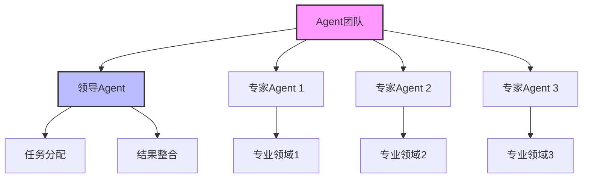
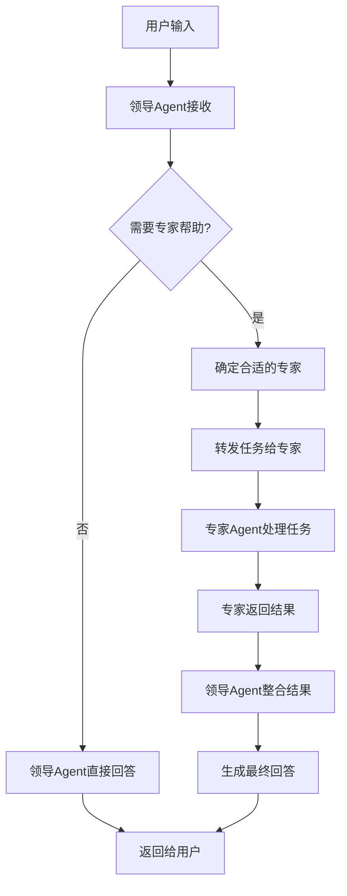
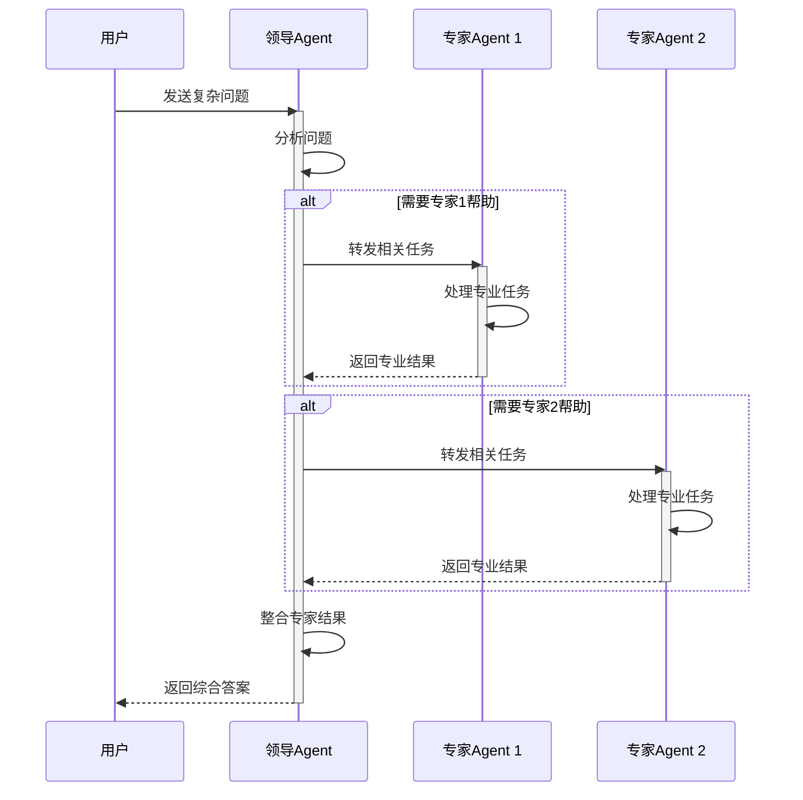
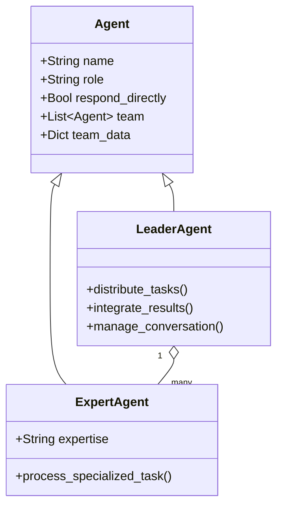
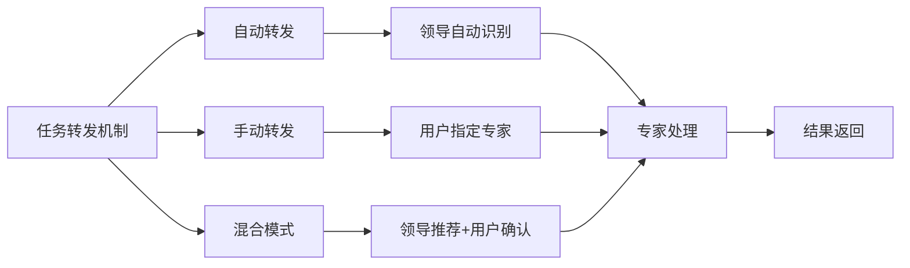
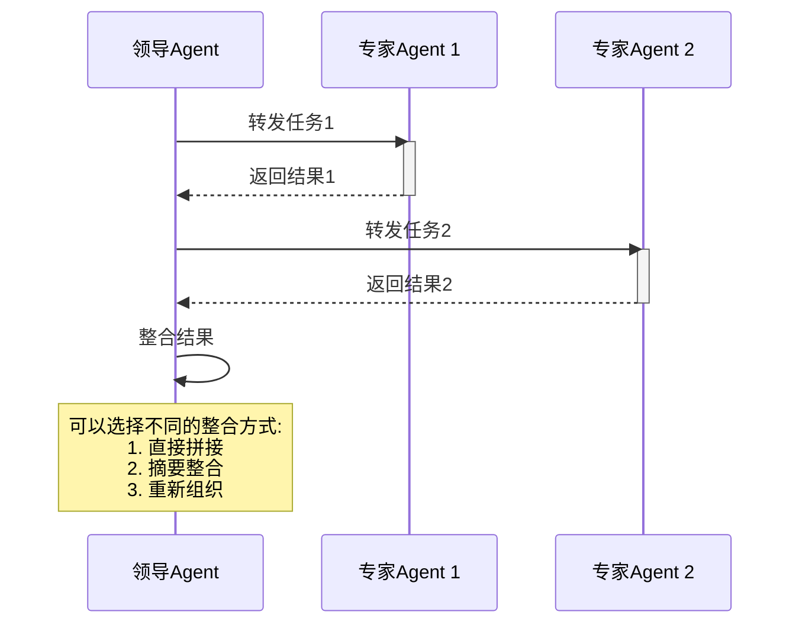

# Agent 团队协作

Agent团队协作功能允许多个专业Agent协同工作，共同解决复杂问题，实现更强大的功能和更自然的交互体验。

## 团队协作架构



## 团队协作流程



## 团队协作序列图



## 团队成员角色定义



## 任务转发机制



## 团队协作代码示例

```python
from agno.agent import Agent
from agno.models.openai import OpenAIChat

# 创建专家Agent
math_expert = Agent(
    name="数学专家",
    model=OpenAIChat(model="gpt-4"),
    description="专门解决数学问题的专家",
    role="数学专家",
    # 专家可以直接回复用户
    respond_directly=True
)

coding_expert = Agent(
    name="编程专家",
    model=OpenAIChat(model="gpt-4"),
    description="专门解决编程问题的专家",
    role="编程专家",
    respond_directly=True
)

# 创建领导Agent
leader_agent = Agent(
    name="助手团队",
    model=OpenAIChat(model="gpt-4"),
    description="一个能够协调多个专家的智能助手",
    # 添加专家团队
    team=[math_expert, coding_expert],
    # 添加团队转发说明
    add_transfer_instructions=True
)

# 使用团队
response = leader_agent.run("我需要写一个计算圆周率的Python程序，请帮我实现")
```

## 团队协作响应整合



团队协作功能使Agent能够处理更复杂的任务，通过专业分工提高效率和质量，为用户提供更全面的服务。 