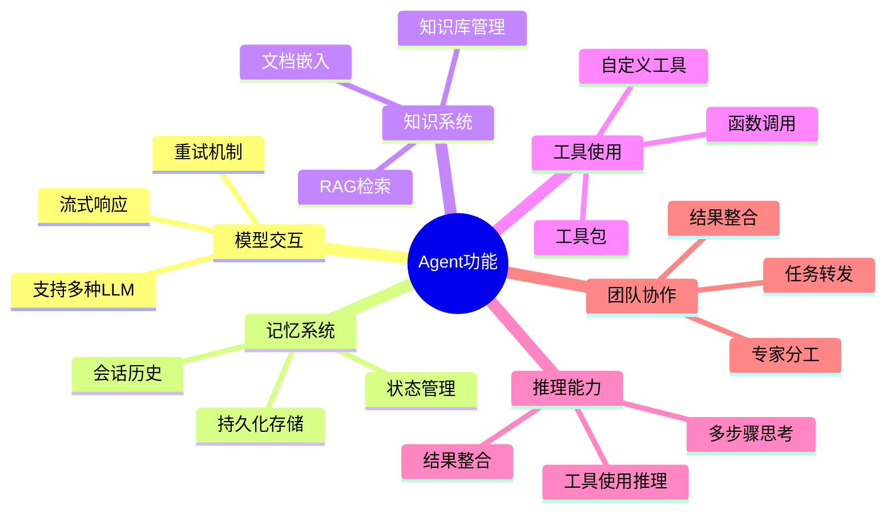

# Agent 文档

欢迎阅读Agno Agent文档！本文档详细介绍了Agent的架构、功能和使用方法，帮助您理解和使用Agno框架构建智能代理应用。

## 文档目录

1. [Agent概述](01_agent_overview.md) - Agent的基本概念和主要组件
2. [Agent初始化流程](02_agent_initialization.md) - Agent的初始化过程和配置选项
3. [Agent运行流程](03_agent_run_process.md) - Agent的运行机制和消息处理流程
4. [Agent推理功能](04_agent_reasoning.md) - Agent的多步骤推理能力
5. [Agent工具使用](05_agent_tools.md) - Agent的工具调用和函数执行
6. [Agent记忆系统](06_agent_memory.md) - Agent的会话历史和状态管理
7. [Agent知识库系统](07_agent_knowledge.md) - Agent的知识检索和RAG功能
8. [Agent团队协作](08_agent_team.md) - Agent的多Agent协作机制

## 快速开始

要创建一个基本的Agent，您可以使用以下代码：

```python
from agno.agent import Agent
from agno.models.openai import OpenAIChat

# 创建一个简单的Agent
agent = Agent(
    model=OpenAIChat(model="gpt-4"),
    name="助手",
    description="一个有用的AI助手"
)

# 运行Agent
response = agent.run("你好，请介绍一下自己")
print(response.content)
```

## 主要功能概览



## 核心概念

- **Agent**: 智能代理的核心类，协调各组件工作
- **Model**: 与大型语言模型交互的接口
- **Memory**: 管理会话历史和状态
- **Knowledge**: 提供知识检索和RAG功能
- **Tools**: 扩展Agent能力的函数和工具
- **Storage**: 提供持久化存储能力
- **Team**: 多Agent协作的团队机制

## 使用场景

Agent框架适用于多种场景，包括但不限于：

1. 客户服务和支持
2. 知识库问答系统
3. 个人助手和生产力工具
4. 教育和培训应用
5. 专业领域顾问
6. 工作流自动化

## 贡献和反馈

我们欢迎社区贡献和反馈，如果您有任何问题或建议，请通过以下方式联系我们：

- GitHub Issues
- 社区论坛
- 电子邮件

感谢您使用Agno Agent框架！ 