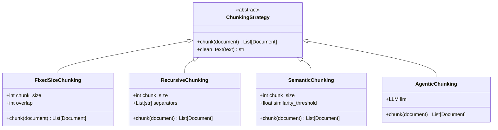
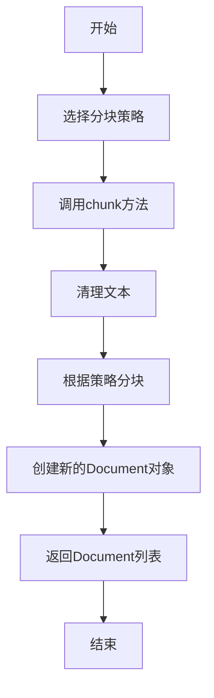
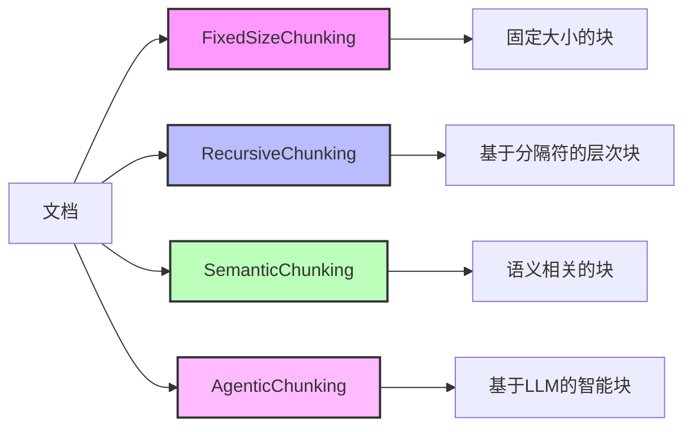
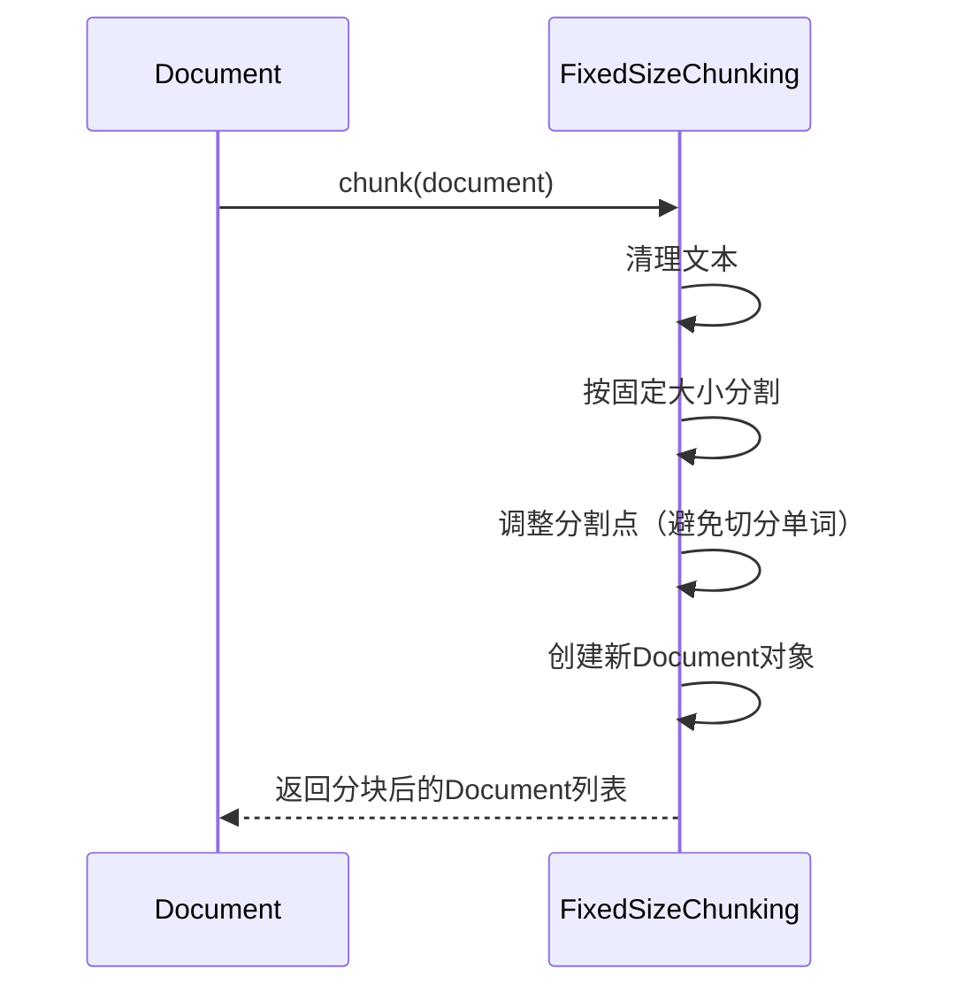

# Chunking系统详解

Chunking系统负责将长文档分割成更小的片段，以便于处理和分析。Agno框架提供了多种分块策略，适用于不同的场景和需求。

## Chunking策略层次结构

## 分块流程

## 分块策略比较

## 分块策略说明

### FixedSizeChunking

固定大小分块策略将文档按照指定的大小（字符数）分割成多个块，可以设置重叠区域以保持上下文连贯性。

### RecursiveChunking

递归分块策略根据一系列分隔符（如段落、句子、单词等）递归地将文档分割成层次化的块。

### SemanticChunking

语义分块策略根据文本的语义相似性将文档分割成语义连贯的块，需要使用嵌入模型计算文本片段之间的相似度。

### AgenticChunking

智能分块策略使用大型语言模型（LLM）来智能地将文档分割成有意义的块，可以理解文档的结构和内容。 