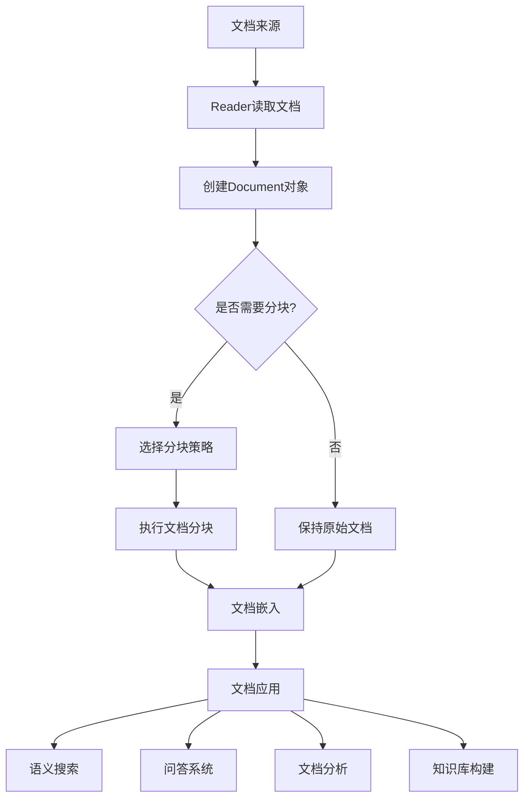
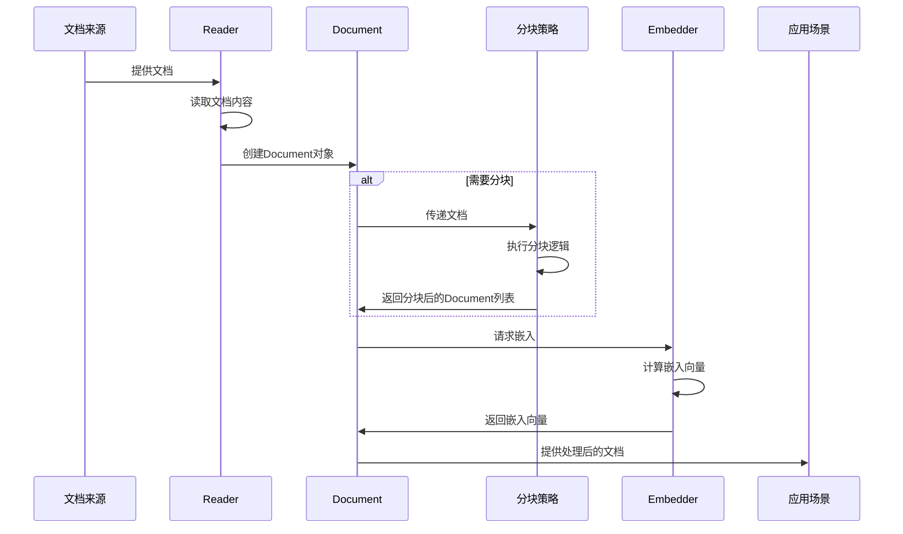
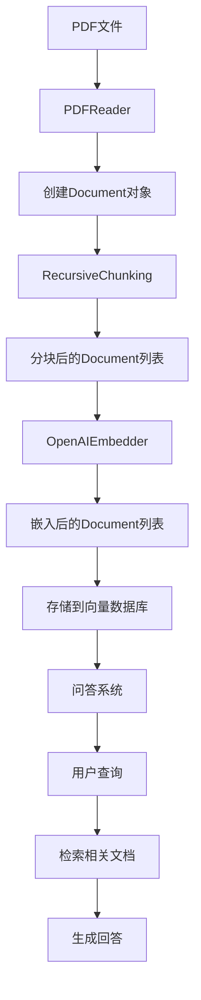

# Document模块完整工作流程

本文档描述了使用Agno框架的Document模块处理文档的完整工作流程，从文档读取到分块、嵌入和应用。

## 整体流程



## 详细工作流程



## 使用示例：从PDF到问答系统



## 代码示例

```python
from agno.document import Document
from agno.document.reader import PDFReader
from agno.document.chunking import RecursiveChunking
from agno.embedder import OpenAIEmbedder
from agno.vectordb import ChromaDB

# 1. 读取PDF文档
pdf_reader = PDFReader(chunk=False)  # 先不分块
documents = pdf_reader.read("example.pdf")

# 2. 分块处理
chunking_strategy = RecursiveChunking(chunk_size=1000)
chunked_documents = []
for doc in documents:
    chunked_documents.extend(chunking_strategy.chunk(doc))

# 3. 嵌入文档
embedder = OpenAIEmbedder()
for doc in chunked_documents:
    doc.embed(embedder)

# 4. 存储到向量数据库
vector_db = ChromaDB(collection_name="example_docs")
vector_db.add_documents(chunked_documents)

# 5. 检索相关文档
query = "什么是文档处理系统?"
relevant_docs = vector_db.similarity_search(query, k=3)

# 6. 使用检索到的文档生成回答
# ...
```

## 各阶段关键点

1. **文档读取阶段**
   - 选择合适的Reader
   - 处理不同格式的文档
   - 提取文档内容和元数据

2. **文档分块阶段**
   - 选择合适的分块策略
   - 设置合适的分块大小和重叠
   - 保持文档的语义完整性

3. **文档嵌入阶段**
   - 选择合适的嵌入模型
   - 处理嵌入向量
   - 管理嵌入使用信息

4. **文档应用阶段**
   - 存储和检索文档
   - 计算文档相似度
   - 构建知识库和问答系统 