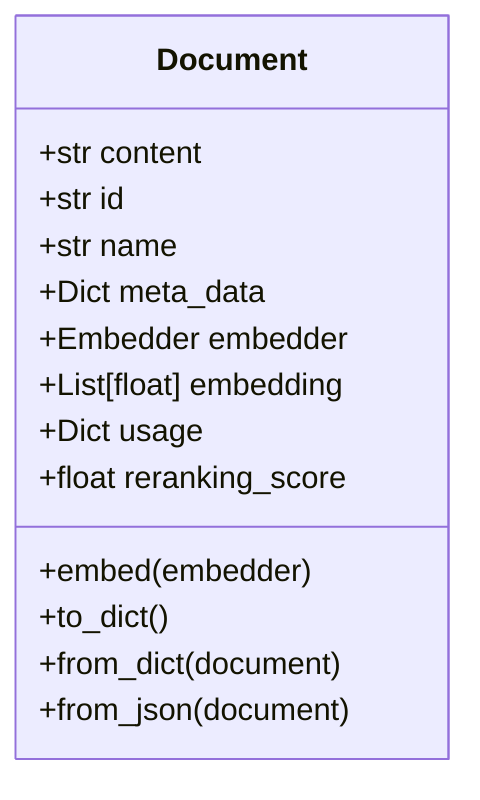
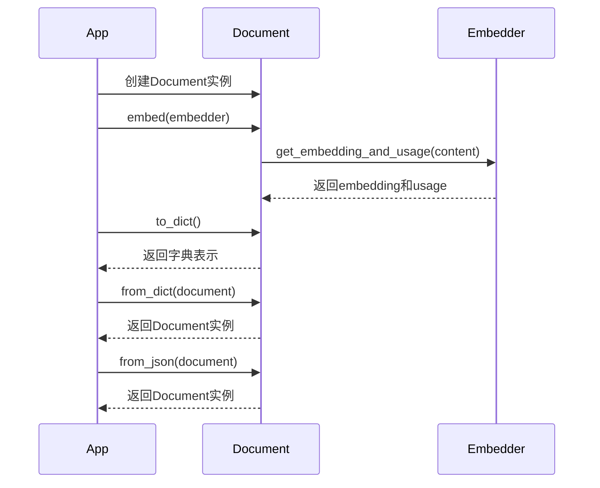

# Document类详解

Document类是整个文档处理系统的核心数据结构，它封装了文档的内容、元数据和嵌入向量等信息。

## 类结构



## 属性说明

- **content**: 文档的文本内容
- **id**: 文档的唯一标识符
- **name**: 文档的名称
- **meta_data**: 与文档相关的元数据，如页码、来源等
- **embedder**: 用于生成文档嵌入的嵌入器
- **embedding**: 文档内容的向量表示
- **usage**: 与嵌入相关的使用信息
- **reranking_score**: 重排序得分，用于文档检索排序

## 方法说明



## 使用示例

```python
# 创建Document实例
doc = Document(
    content="这是一个示例文档",
    name="example",
    meta_data={"source": "user_input"}
)

# 使用嵌入器生成嵌入
from agno.embedder import OpenAIEmbedder
embedder = OpenAIEmbedder()
doc.embed(embedder)

# 转换为字典
doc_dict = doc.to_dict()

# 从字典创建Document
new_doc = Document.from_dict(doc_dict)
```