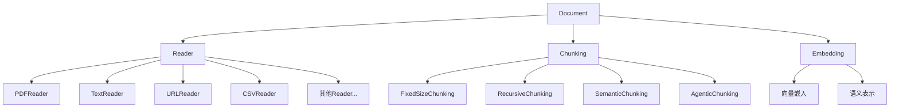

# Document模块概述

Document模块是Agno框架中用于处理各种文档的核心组件。它提供了一套完整的工具，用于读取、处理、分块和嵌入各种格式的文档。

## 主要组件

## 核心功能

1. **文档读取**：支持多种格式（PDF、文本、URL、CSV等）的文档读取
2. **文档分块**：将长文档分割成适合处理的小块
3. **文档嵌入**：将文档内容转换为向量表示，便于语义搜索和处理
4. **元数据管理**：保存和处理与文档相关的元数据

## 使用场景

- 知识库构建
- 文档检索系统
- 问答系统
- 文档分析和处理
- 语义搜索 