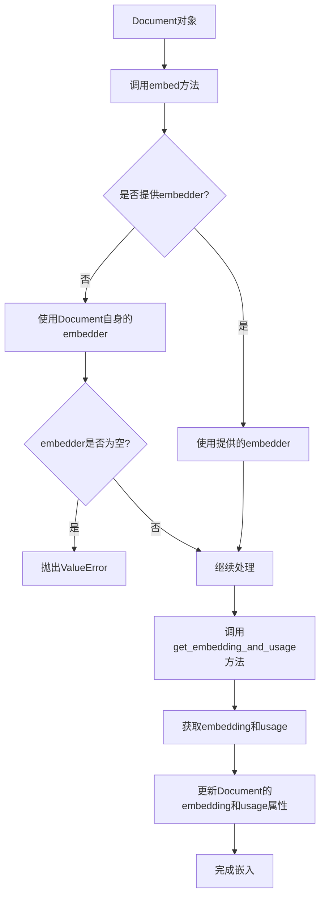
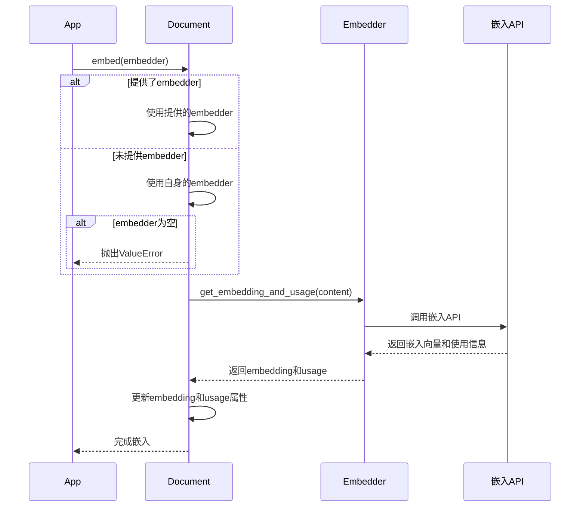
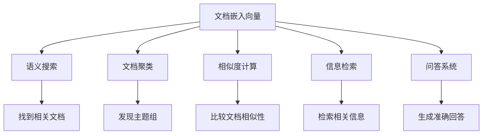

# 文档嵌入过程详解

文档嵌入是将文本内容转换为向量表示的过程，这些向量可以用于语义搜索、相似度计算和其他自然语言处理任务。

## 嵌入流程



## 嵌入过程时序图



## 支持的嵌入模型

Agno框架支持多种嵌入模型，包括但不限于：

1. **OpenAI嵌入模型**：如text-embedding-ada-002、text-embedding-3-small等
2. **Hugging Face模型**：如sentence-transformers系列模型
3. **自定义嵌入模型**：用户可以实现自己的嵌入器

## 嵌入向量的应用



## 嵌入示例

```python
from agno.document import Document
from agno.embedder import OpenAIEmbedder

# 创建Document实例
doc = Document(
    content="这是一个示例文档，用于演示嵌入过程。",
    name="embedding_example"
)

# 创建嵌入器
embedder = OpenAIEmbedder(model="text-embedding-3-small")

# 嵌入文档
doc.embed(embedder)

# 查看嵌入结果
print(f"嵌入维度: {len(doc.embedding)}")
print(f"使用信息: {doc.usage}")
``` 