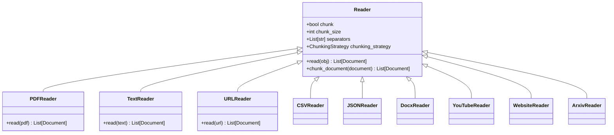
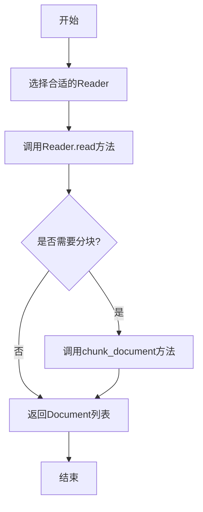
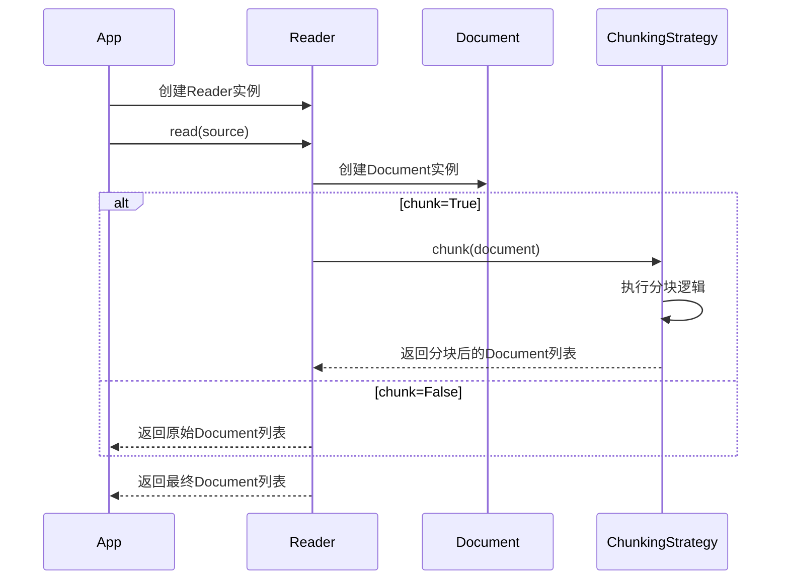

# Reader系统详解

Reader系统负责从各种来源读取文档，并将其转换为Document对象。Agno框架支持多种文档格式，每种格式都有对应的Reader实现。

## Reader类层次结构

## 读取流程

## 读取和分块过程

## 支持的文档类型

| Reader类 | 支持的格式 | 描述 |
|---------|-----------|------|
| PDFReader | PDF文件 | 读取本地PDF文件 |
| PDFUrlReader | PDF URL | 从URL读取PDF文件 |
| TextReader | 文本文件 | 读取纯文本文件 |
| URLReader | 网页URL | 读取网页内容 |
| CSVReader | CSV文件 | 读取CSV表格数据 |
| JSONReader | JSON文件 | 读取JSON格式数据 |
| DocxReader | DOCX文件 | 读取Word文档 |
| YouTubeReader | YouTube视频 | 读取YouTube视频字幕 |
| WebsiteReader | 网站 | 爬取整个网站内容 |
| ArxivReader | Arxiv论文 | 读取Arxiv学术论文 | 