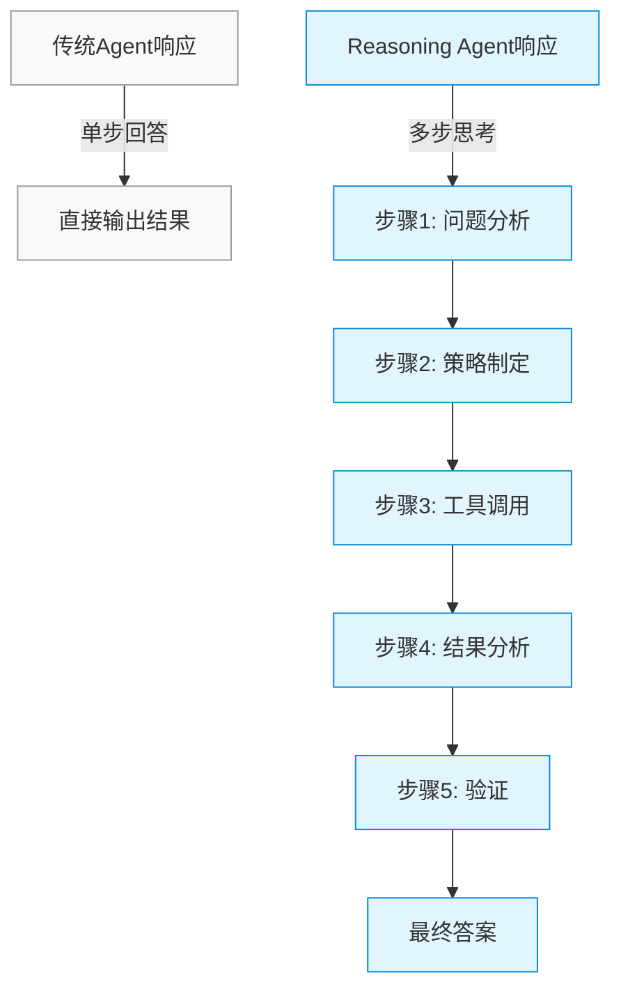
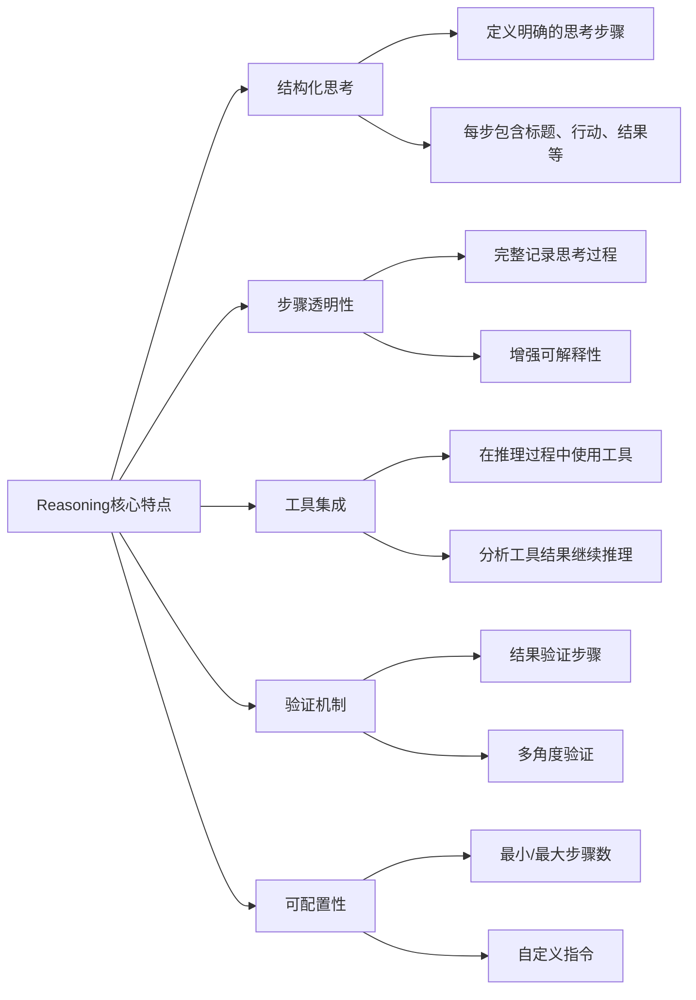
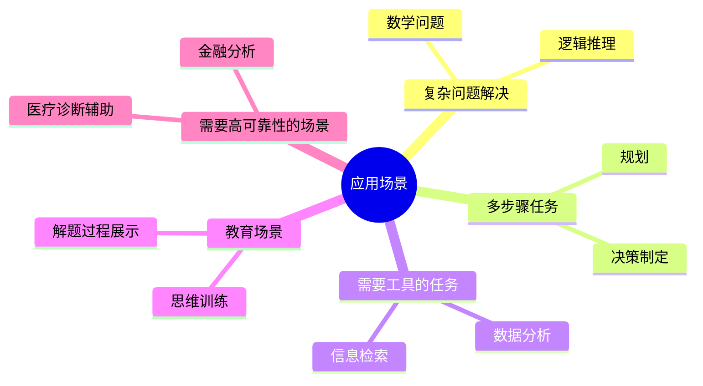

# Reasoning 概述

Reasoning（推理）模块是Agno框架中的一个核心组件，它使Agent能够通过结构化的多步骤思考过程来解决复杂问题。本文档介绍Reasoning模块的基本概念、设计理念和核心功能。

## 什么是Reasoning

Reasoning是一种结构化的思考方法，它将复杂问题的解决过程分解为一系列明确定义的步骤。每个步骤都包含特定的思考内容、行动和结果，使Agent能够像人类一样逐步推理问题。

## Reasoning的核心特点

## Reasoning与传统Agent的区别

| 特性 | 传统Agent | Reasoning Agent |
|------|-----------|----------------|
| 思考过程 | 隐式，不可见 | 显式，结构化 |
| 问题解决 | 一步到位 | 分步骤推理 |
| 工具使用 | 可能随机或不一致 | 有计划地集成到推理步骤中 |
| 验证机制 | 通常缺乏 | 内置验证步骤 |
| 可解释性 | 有限 | 高度透明 |
| 复杂问题处理 | 可能不完整 | 系统性分解和解决 |

## Reasoning的应用场景

## Reasoning的工作原理

Reasoning模块通过以下方式工作：

1. **问题接收**：Agent接收用户的问题或任务
2. **推理初始化**：创建一个专门的推理Agent实例
3. **步骤执行**：推理Agent开始执行一系列结构化的思考步骤
4. **工具调用**：在需要时，推理Agent可以调用工具来获取信息或执行操作
5. **结果验证**：推理Agent会验证其结论，确保准确性
6. **答案生成**：最终生成一个经过验证的答案
7. **过程展示**：可选择性地展示完整的推理过程

## 总结

Reasoning模块通过引入结构化的思考过程，显著提升了Agent处理复杂问题的能力。它不仅使Agent能够更系统地解决问题，还提供了透明的思考过程，增强了可解释性和可靠性。在后续文档中，我们将深入探讨Reasoning模块的数据结构、执行流程和与Agent的集成方式。 