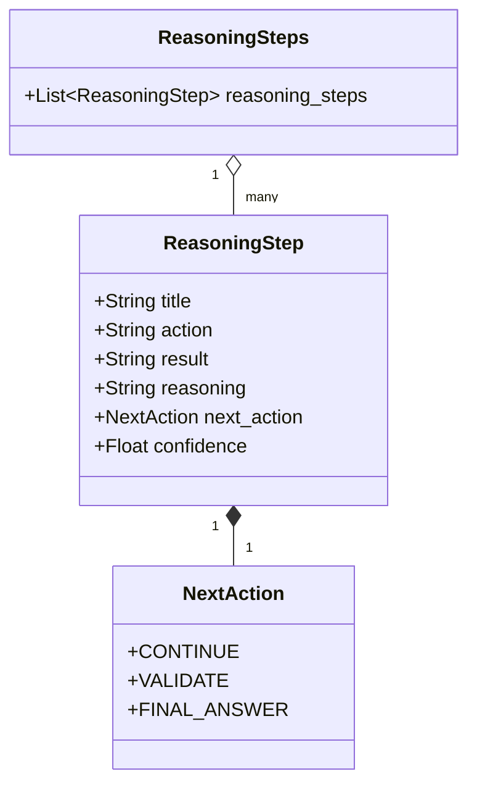
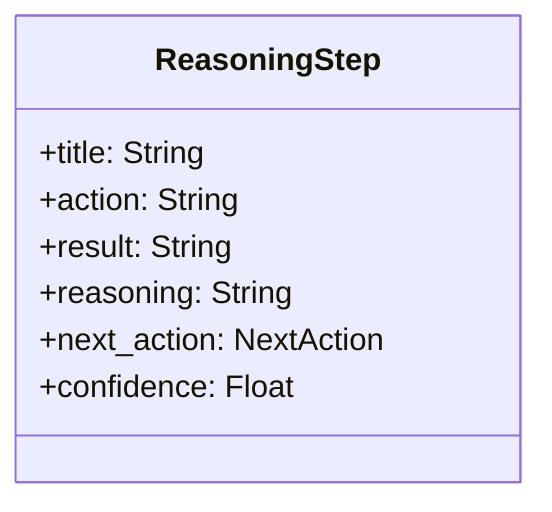
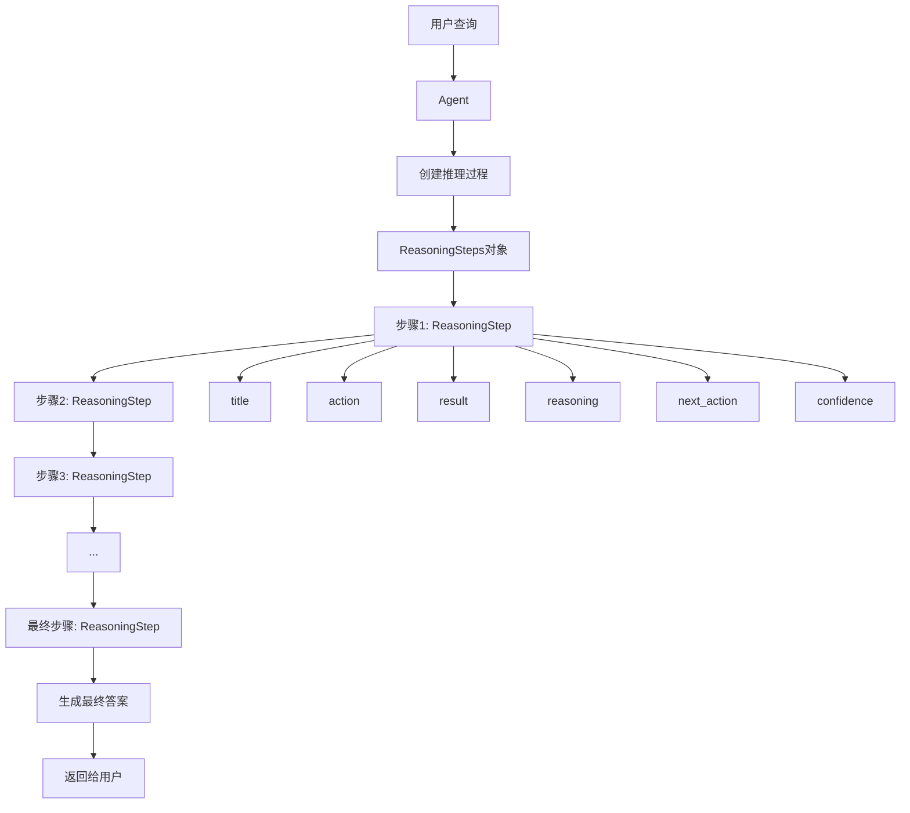

# Reasoning 数据结构

Reasoning模块的核心是一系列精心设计的数据结构，它们定义了推理过程中的各个组件和它们之间的关系。本文档详细介绍这些数据结构及其作用。

## 核心数据结构概览



## NextAction 枚举

NextAction是一个枚举类，定义了推理步骤完成后的下一步行动类型：

```python
class NextAction(str, Enum):
    CONTINUE = "continue"        # 继续执行下一个推理步骤
    VALIDATE = "validate"        # 验证当前的推理结果
    FINAL_ANSWER = "final_answer"  # 提供最终答案，结束推理过程
```

这个枚举类使Agent能够明确地表达每个推理步骤后应该采取的行动，确保推理过程的流畅性和完整性。

## ReasoningStep 类

ReasoningStep类表示推理过程中的单个步骤，包含以下字段：



详细说明：

- **title**: 步骤的简洁标题，概括该步骤的目的
- **action**: 该步骤中要执行的行动，以第一人称描述（"我将..."）
- **result**: 执行行动后的结果，同样以第一人称描述
- **reasoning**: 该步骤背后的思考过程和考虑因素
- **next_action**: 完成当前步骤后的下一步行动（继续、验证或最终答案）
- **confidence**: 对该步骤的信心分数（0.0到1.0）

## ReasoningSteps 类

ReasoningSteps类是一个容器类，用于存储和管理一系列ReasoningStep对象：

```python
class ReasoningSteps(BaseModel):
    reasoning_steps: List[ReasoningStep] = Field(..., description="A list of reasoning steps")
```

这个类使Agent能够组织和跟踪整个推理过程中的所有步骤，便于后续分析和展示。

## 数据流图



## 数据结构使用示例

```python
# 创建一个推理步骤
step1 = ReasoningStep(
    title="分析问题",
    action="我将仔细分析用户提出的数学问题，确定需要计算的是什么。",
    result="我发现这是一个关于圆的面积计算问题。已知圆的周长是10π，需要计算面积。",
    reasoning="理解问题是解决任何数学问题的第一步。通过分析问题描述，我确定这是一个基本的几何问题，涉及圆的周长和面积之间的关系。",
    next_action=NextAction.CONTINUE,
    confidence=0.95
)

# 创建一个推理步骤集合
reasoning_steps = ReasoningSteps(reasoning_steps=[step1])

# 添加更多步骤
step2 = ReasoningStep(
    title="应用公式",
    action="我将使用圆的周长公式和面积公式来解决这个问题。",
    result="使用周长公式 C = 2πr，得知 10π = 2πr，因此 r = 5。使用面积公式 A = πr²，得到 A = π × 5² = 25π。",
    reasoning="圆的周长和面积都与半径有关，通过周长可以计算出半径，再通过半径计算面积。这是一个直接的应用几何公式的过程。",
    next_action=NextAction.VALIDATE,
    confidence=0.98
)

reasoning_steps.reasoning_steps.append(step2)
```

## 数据结构的优势

1. **结构化思考**：明确定义的字段确保每个推理步骤都包含完整的思考过程
2. **流程控制**：NextAction枚举使Agent能够控制推理流程的进展
3. **可解释性**：详细记录每个步骤的思考过程，增强透明度
4. **自我评估**：通过confidence字段，Agent可以表达对每个步骤的确信度
5. **模块化**：每个步骤都是独立的，便于组合和重用

通过这些精心设计的数据结构，Reasoning模块能够有效地组织和管理复杂的推理过程，使Agent能够系统地解决问题并提供透明的思考过程。 