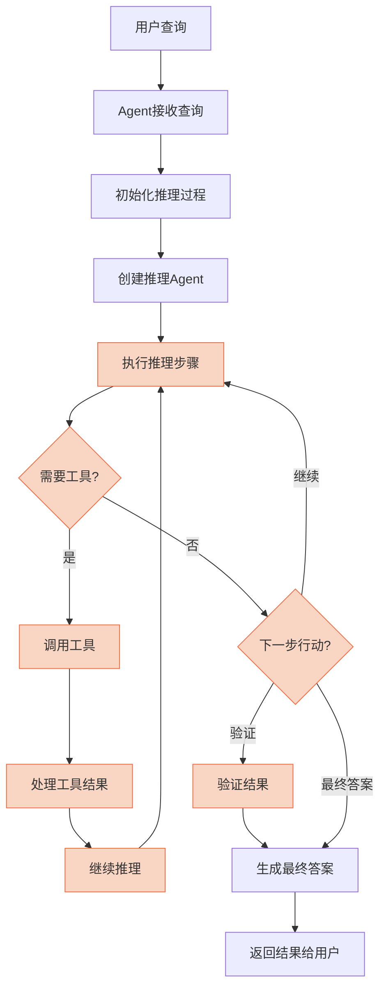
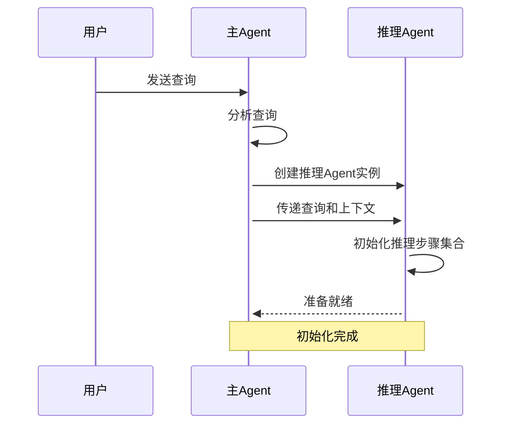
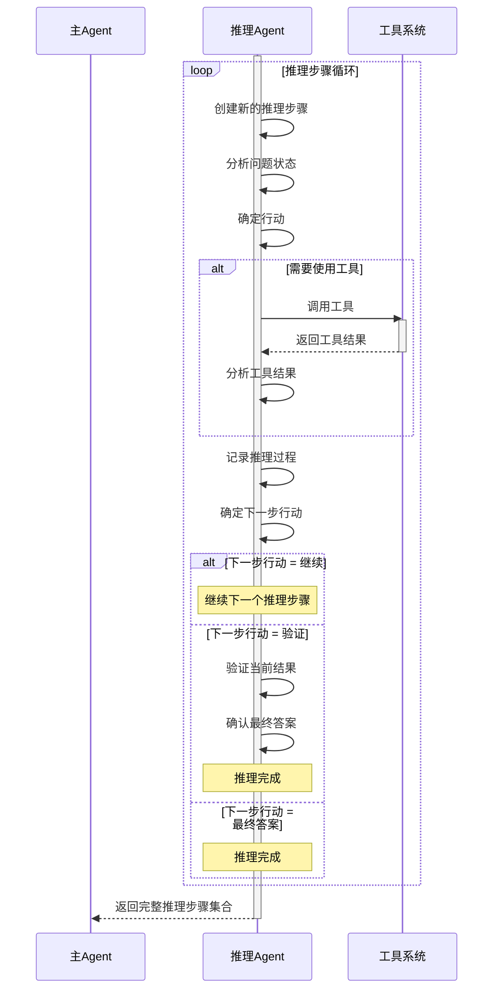
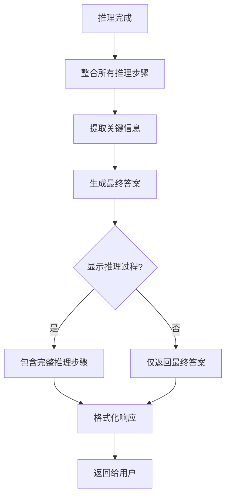
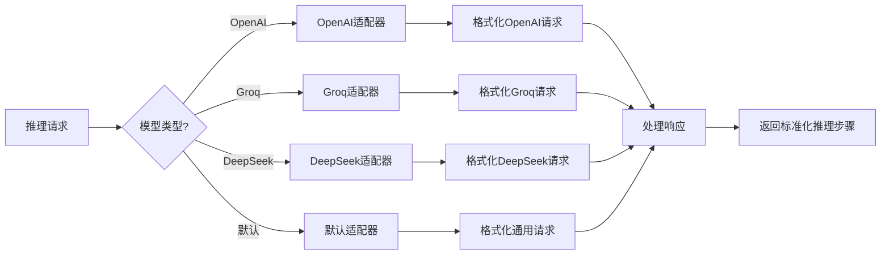
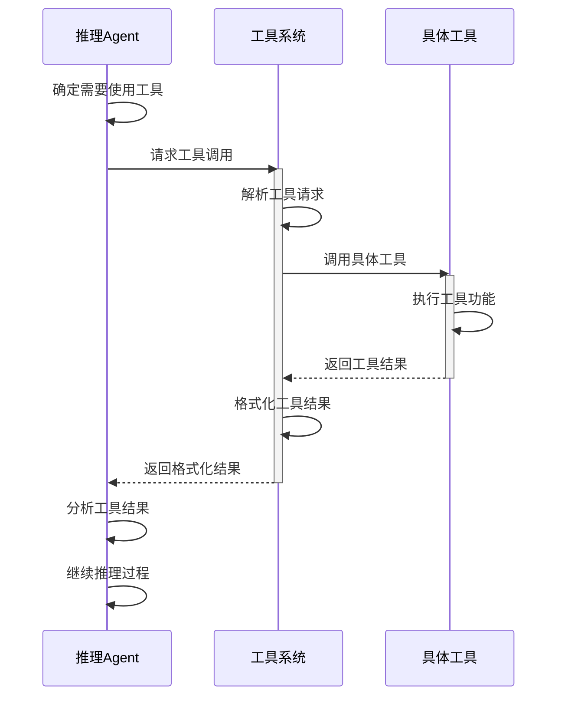
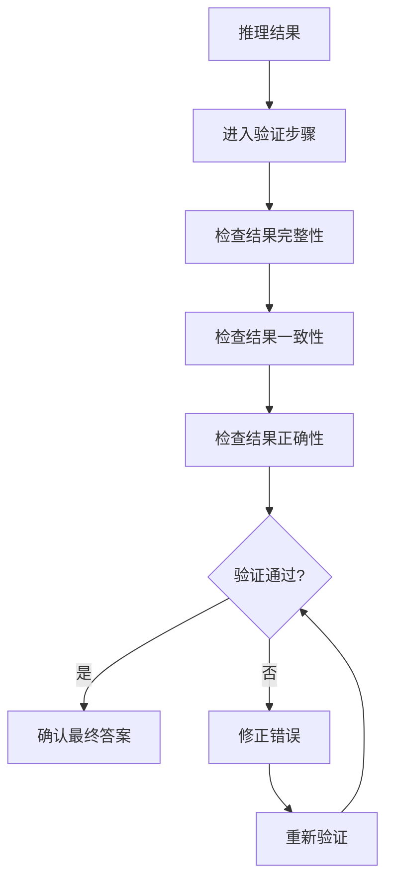

# Reasoning 执行流程

Reasoning模块的执行流程是一个结构化的过程，它定义了Agent如何进行多步骤推理来解决复杂问题。本文档详细介绍这个执行流程的各个阶段和关键组件。

## 执行流程概览

## 详细执行流程

### 1. 初始化阶段

在初始化阶段，主Agent接收用户查询，然后创建一个专门的推理Agent实例来处理这个查询。推理Agent会初始化一个空的推理步骤集合，准备开始推理过程。

### 2. 推理执行阶段

在推理执行阶段，推理Agent会执行一系列推理步骤，每个步骤都包括分析问题、确定行动、执行行动（可能包括调用工具）、记录结果和确定下一步行动。这个过程会一直持续，直到达到验证步骤或最终答案。

### 3. 结果生成阶段

在结果生成阶段，推理Agent会整合所有推理步骤，提取关键信息，生成最终答案。根据配置，可以选择是否在响应中包含完整的推理过程。

## 推理模型适配器的作用

推理模型适配器负责将推理请求转换为特定模型可以理解的格式，并将模型的响应转换回标准化的推理步骤格式。这使得Reasoning模块可以支持多种不同的语言模型。

## 工具调用集成

推理Agent可以在推理过程中调用工具来获取信息或执行操作。工具系统负责解析工具请求，调用具体工具，并将结果返回给推理Agent。

## 验证机制

验证机制是推理过程的一个重要部分，它确保推理结果的准确性和可靠性。推理Agent会检查结果的完整性、一致性和正确性，如果发现问题，会进行修正并重新验证。

## 执行流程示例

以下是一个简化的推理执行流程示例：

1. 用户向Agent提出问题："如果一个圆的周长是10π，那么它的面积是多少?"
2. Agent创建一个推理Agent实例，并传递问题
3. 推理Agent开始第一个推理步骤：分析问题
4. 推理Agent确定需要使用圆的公式，创建第二个推理步骤：应用公式
5. 推理Agent计算出答案：25π
6. 推理Agent创建验证步骤，确认答案的正确性
7. 推理Agent生成最终答案，并返回给主Agent
8. 主Agent将答案返回给用户

通过这种结构化的执行流程，Reasoning模块能够系统地解决复杂问题，并提供透明的思考过程。 