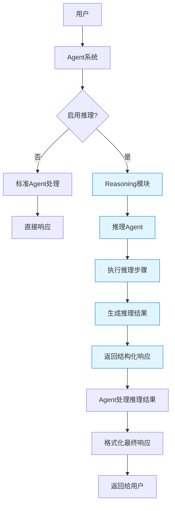
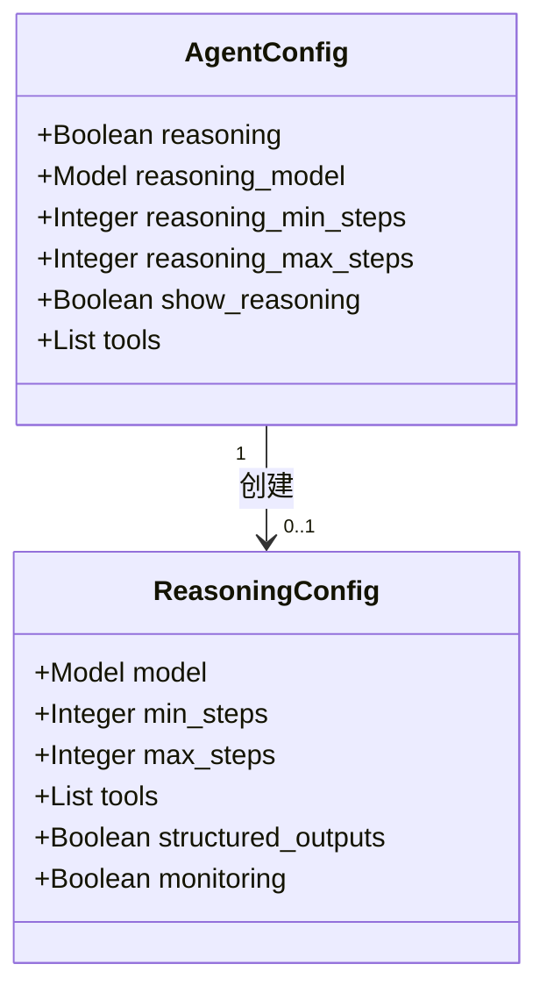
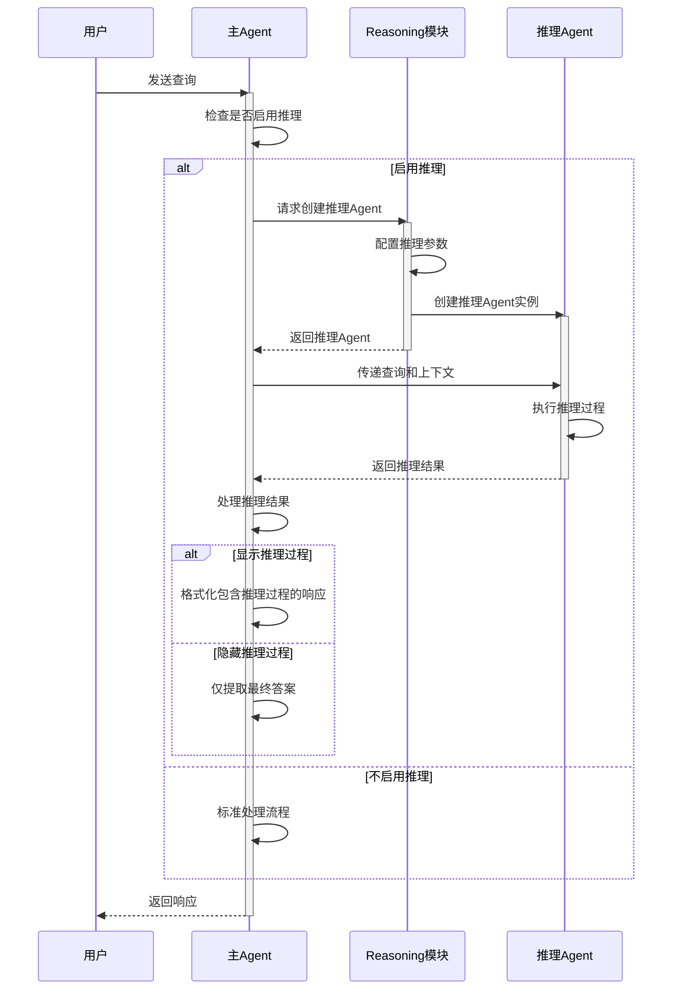
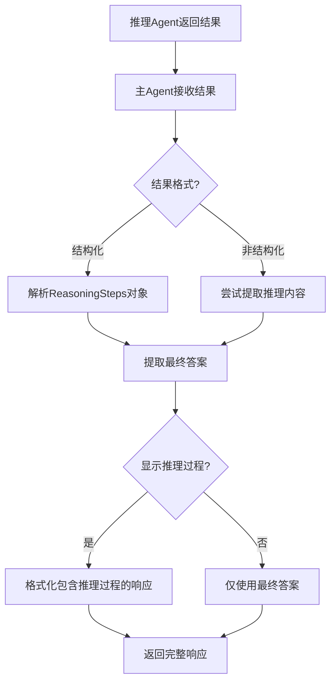
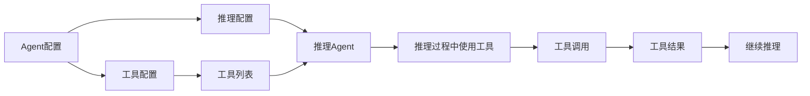
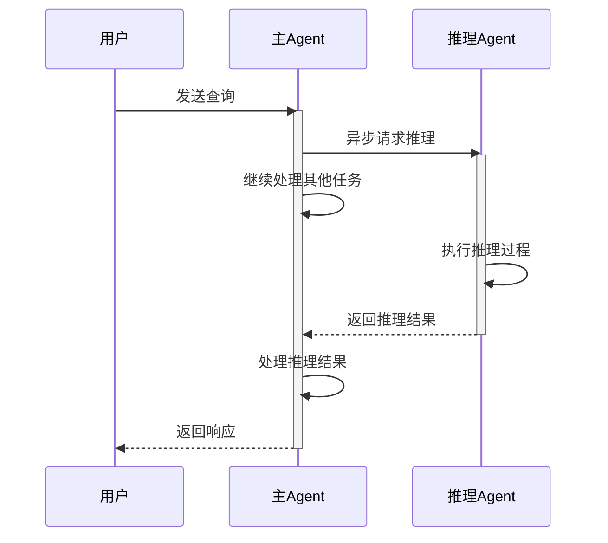

# Reasoning 与 Agent 集成

Reasoning模块与Agent系统的集成是Agno框架的一个核心特性，它使Agent能够利用结构化的推理能力来解决复杂问题。本文档详细介绍Reasoning模块如何与Agent系统集成，以及如何配置和使用这种集成。

## 集成架构概览



## Agent配置中的Reasoning选项



Agent配置中与Reasoning相关的主要选项包括：

- **reasoning**: 布尔值，是否启用推理功能
- **reasoning_model**: 用于推理的模型，可以与主Agent模型不同
- **reasoning_min_steps**: 最少推理步骤数
- **reasoning_max_steps**: 最多推理步骤数
- **show_reasoning**: 是否在最终响应中显示推理过程
- **tools**: 可用于推理过程的工具列表

## 集成流程详解



## 代码示例：配置启用推理的Agent

```python
from agno.agent import Agent
from agno.models.openai import OpenAIChat
from agno.tools.web import WebSearchTool

# 创建一个启用推理功能的Agent
agent = Agent(
    model=OpenAIChat(model="gpt-3.5-turbo"),
    
    # 启用推理功能
    reasoning=True,
    
    # 使用更强大的模型进行推理
    reasoning_model=OpenAIChat(model="gpt-4"),
    
    # 配置推理步骤数
    reasoning_min_steps=2,
    reasoning_max_steps=5,
    
    # 在最终响应中显示推理过程
    show_reasoning=True,
    
    # 提供工具供推理过程使用
    tools=[WebSearchTool()]
)

# 使用Agent解决问题
response = agent.run("分析最近的气候变化趋势及其对全球农业的影响")
```

## 推理结果的处理



当推理Agent返回结果后，主Agent会根据配置决定如何处理这些结果：

1. 解析推理步骤（ReasoningSteps对象）
2. 提取最终答案
3. 根据show_reasoning配置决定是否在最终响应中包含推理过程
4. 格式化最终响应并返回给用户

## 推理与工具的集成



推理Agent可以使用主Agent配置的工具，这使得推理过程能够访问外部信息和功能。工具调用的结果会被整合到推理过程中，帮助Agent得出更准确的结论。

## 异步支持



Reasoning模块支持异步操作，这使得Agent可以在等待推理结果的同时处理其他任务，提高整体效率。

## 集成的优势

1. **模块化设计**：Reasoning模块可以独立配置和使用，与主Agent松耦合
2. **灵活的模型选择**：可以为推理过程选择不同于主Agent的模型，优化性能和成本
3. **可配置的步骤控制**：通过min_steps和max_steps参数控制推理深度
4. **透明度选项**：可以选择是否在最终响应中显示推理过程
5. **工具集成**：推理过程可以使用Agent配置的工具，增强功能
6. **异步支持**：支持异步操作，提高效率

通过这种灵活而强大的集成，Reasoning模块使Agent能够以结构化的方式解决复杂问题，同时保持高度的可配置性和可扩展性。 