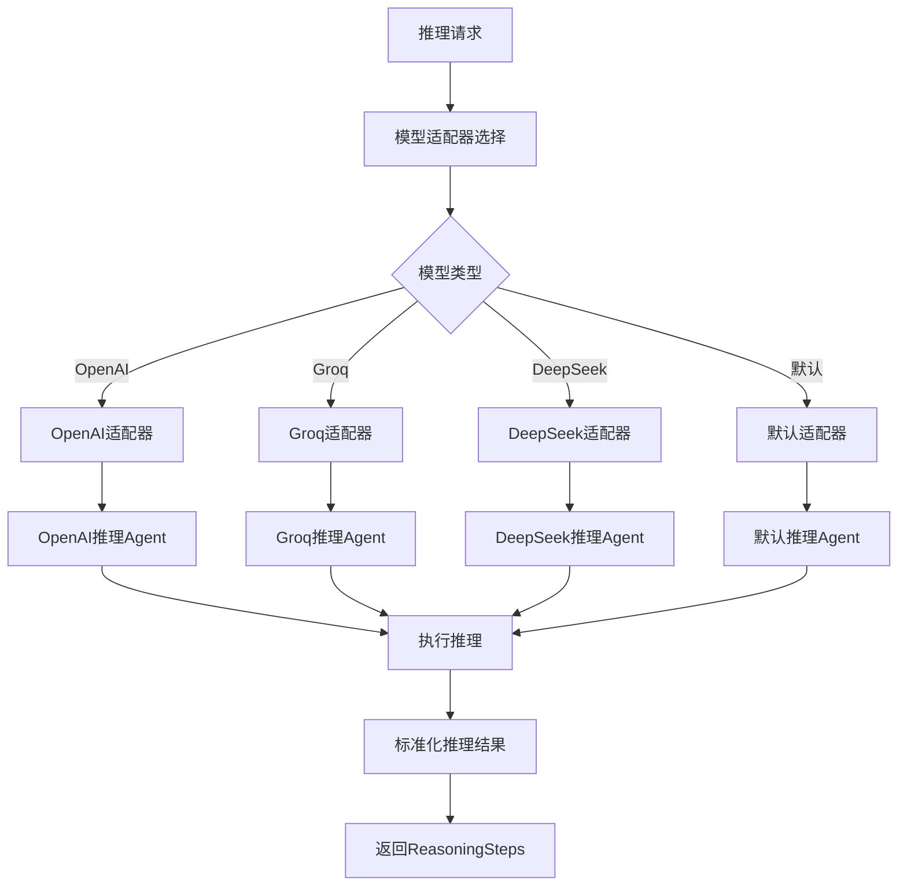
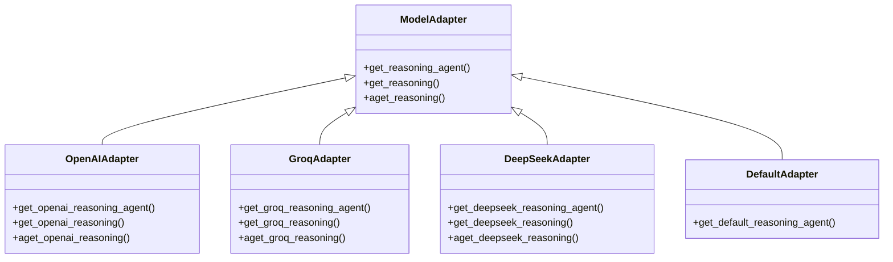
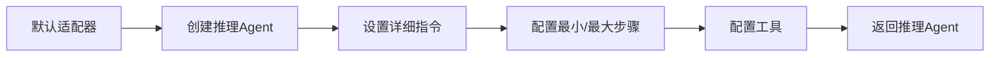
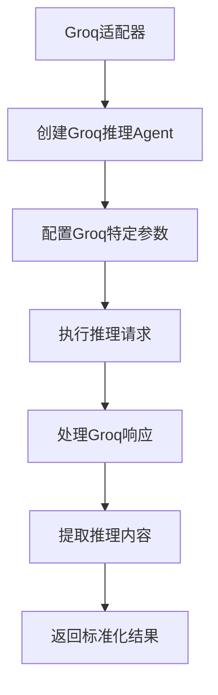
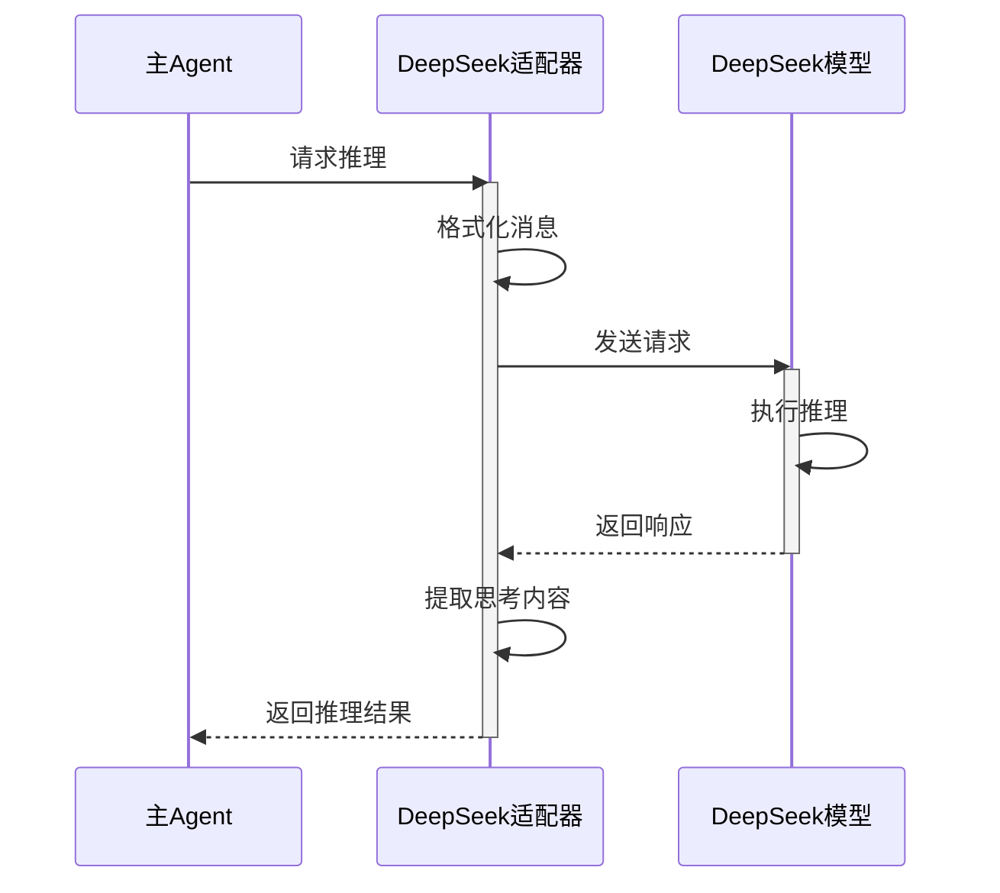
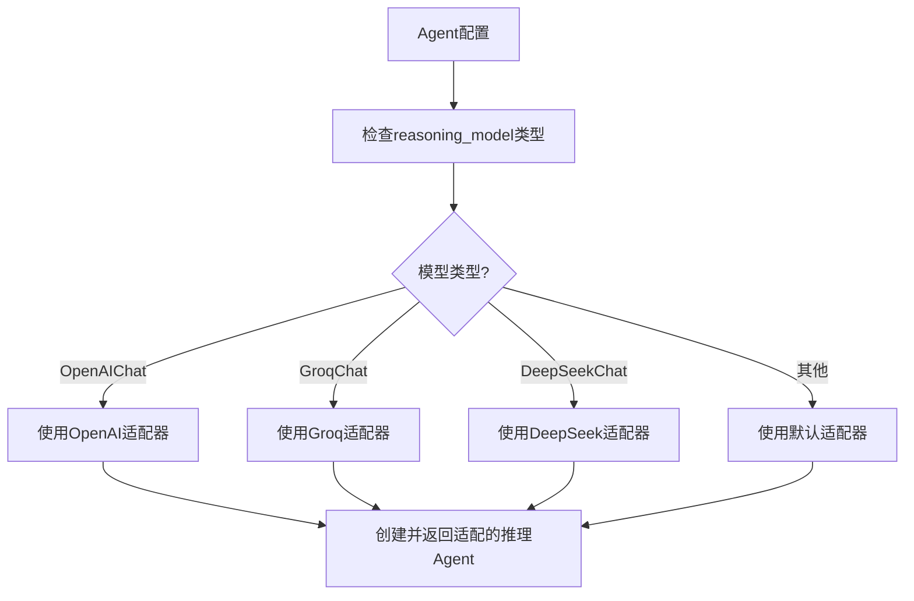

# Reasoning 模型适配器

Reasoning模块支持多种不同的语言模型，通过专门的适配器来处理不同模型的特性和要求。本文档详细介绍Reasoning模块中的模型适配器，它们如何工作以及如何扩展支持新的模型。

## 模型适配器架构



## 支持的模型适配器

Reasoning模块目前支持以下模型适配器：

1. **默认适配器** (default.py)
2. **OpenAI适配器** (openai.py)
3. **Groq适配器** (groq.py)
4. **DeepSeek适配器** (deepseek.py)

每个适配器都针对特定模型的特性进行了优化，确保最佳的推理性能和结果质量。

## 适配器组件详解



每个适配器通常包含以下核心功能：

1. **get_xxx_reasoning_agent()**: 创建一个针对特定模型优化的推理Agent
2. **get_xxx_reasoning()**: 同步执行推理过程并返回结果
3. **aget_xxx_reasoning()**: 异步执行推理过程并返回结果

## 默认适配器 (default.py)

默认适配器提供了一个通用的推理Agent实现，适用于大多数语言模型。它设置了详细的指令，指导模型如何执行结构化的推理过程。



核心功能：

```python
def get_default_reasoning_agent(
    reasoning_model: Model,
    min_steps: int,
    max_steps: int,
    tools: Optional[List[Union[Toolkit, Callable, Function]]] = None,
    structured_outputs: bool = False,
    monitoring: bool = False,
) -> Optional["Agent"]:
    # 创建并配置推理Agent
    # ...
```

## OpenAI适配器 (openai.py)

OpenAI适配器针对OpenAI模型（如GPT-3.5和GPT-4）进行了优化，利用这些模型的特性来提供高质量的推理结果。


核心功能：

```python
def get_openai_reasoning(reasoning_agent: "Agent", messages: List[Message]) -> Optional[Message]:
    # 执行OpenAI推理并处理结果
    # ...
```

## Groq适配器 (groq.py)

Groq适配器针对Groq模型进行了优化，利用Groq的高性能特性来提供快速的推理结果。



核心功能：

```python
def get_groq_reasoning_agent(reasoning_model: Model, **kwargs) -> "Agent":
    # 创建并配置Groq推理Agent
    # ...

def get_groq_reasoning(reasoning_agent: "Agent", messages: List[Message]) -> Optional[Message]:
    # 执行Groq推理并处理结果
    # ...
```

## DeepSeek适配器 (deepseek.py)

DeepSeek适配器针对DeepSeek模型进行了优化，利用这些模型的特性来提供高质量的推理结果。



核心功能：

```python
def get_deepseek_reasoning(reasoning_agent: "Agent", messages: List[Message]) -> Optional[Message]:
    # 执行DeepSeek推理并处理结果
    # ...
```

## 适配器选择逻辑



当Agent配置启用推理功能时，系统会根据提供的reasoning_model类型自动选择合适的适配器。

## 模型特定优化

每个适配器都包含针对特定模型的优化：

1. **OpenAI适配器**:
   - 处理思考标签 (`<think>...</think>`)
   - 适应OpenAI的消息格式
   - 支持异步操作

2. **Groq适配器**:
   - 针对Groq的高速处理进行优化
   - 适应Groq的API特性
   - 支持异步操作

3. **DeepSeek适配器**:
   - 针对DeepSeek模型的特性进行优化
   - 适应DeepSeek的消息格式
   - 支持异步操作

## 扩展支持新模型

要为Reasoning模块添加新的模型支持，需要创建一个新的适配器文件，实现以下核心功能：

```python
# 示例：为新模型创建适配器
def get_newmodel_reasoning_agent(reasoning_model: Model, **kwargs) -> "Agent":
    # 创建并配置新模型的推理Agent
    # ...

def get_newmodel_reasoning(reasoning_agent: "Agent", messages: List[Message]) -> Optional[Message]:
    # 执行新模型的推理并处理结果
    # ...

async def aget_newmodel_reasoning(reasoning_agent: "Agent", messages: List[Message]) -> Optional[Message]:
    # 异步执行新模型的推理并处理结果
    # ...
```

然后，在Agent系统中添加对新适配器的支持，使其能够根据模型类型自动选择正确的适配器。

## 适配器的优势

1. **模型特定优化**: 每个适配器都针对特定模型的特性进行了优化
2. **统一接口**: 所有适配器提供统一的接口，简化集成
3. **可扩展性**: 易于添加新模型的支持
4. **同步和异步支持**: 支持同步和异步操作，提高灵活性
5. **标准化输出**: 所有适配器返回标准化的推理结果，便于后续处理

通过这种适配器架构，Reasoning模块能够支持多种不同的语言模型，同时保持一致的接口和行为，使Agent能够灵活地选择最适合特定任务的模型。 