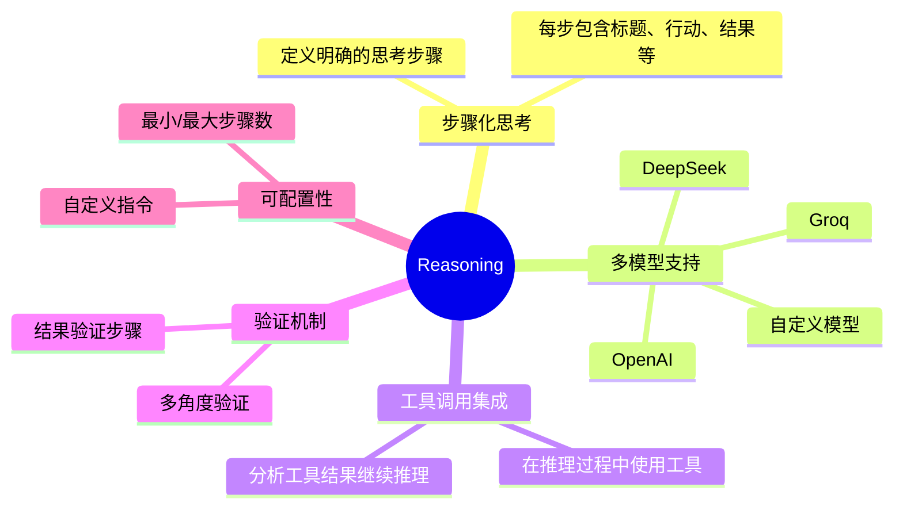

# Reasoning 模块总览

Reasoning模块是Agno框架中的核心组件，它使Agent能够通过多步骤思考来解决复杂问题，模拟人类的思考过程。本文档集合详细介绍了Reasoning模块的架构、功能和使用方法。

## 文档目录

1. [Reasoning概述](01_reasoning_overview.md) - Reasoning模块的基本概念和作用
2. [Reasoning数据结构](02_reasoning_data_structure.md) - 核心数据结构和类定义
3. [Reasoning执行流程](03_reasoning_execution_flow.md) - 推理过程的详细执行流程
4. [Reasoning与Agent集成](04_reasoning_agent_integration.md) - Reasoning模块如何与Agent系统集成
5. [Reasoning模型适配器](05_reasoning_model_adapters.md) - 不同LLM模型的适配器实现

## Reasoning模块核心功能



## 快速开始

```python
from agno.agent import Agent
from agno.models.openai import OpenAIChat

# 创建一个启用推理功能的Agent
agent = Agent(
    model=OpenAIChat(model="gpt-4"),
    reasoning=True,  # 启用推理功能
    reasoning_min_steps=1,  # 最少推理步骤
    reasoning_max_steps=5,  # 最多推理步骤
    # 可以指定不同的推理模型
    reasoning_model=OpenAIChat(model="gpt-4"),
    # 显示推理过程
    show_reasoning=True
)

# 使用推理功能解决问题
response = agent.run("解决这个复杂的数学问题: 如果一个圆的周长是10π，那么它的面积是多少?")
```

## Reasoning在Agent中的作用

Reasoning模块使Agent能够:
- 分解复杂问题为可管理的步骤
- 在每个步骤中明确思考过程和行动
- 在需要时调用工具并分析结果
- 验证推理结果确保准确性
- 提供透明的思考过程，增强可解释性

通过这些能力，Agent可以处理需要深度思考和多步骤分析的复杂任务，如数学问题、逻辑推理、规划等。 