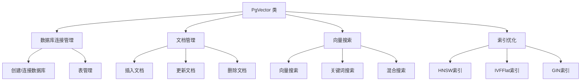
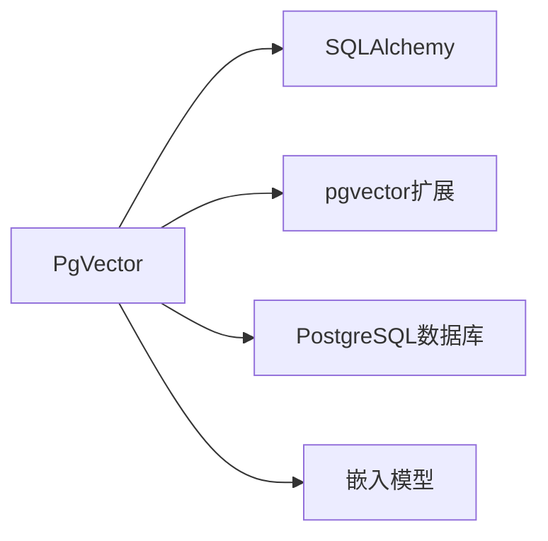

# PgVector 概述

PgVector 是一个基于 PostgreSQL 和 pgvector 扩展的向量数据库接口，用于高效存储和检索向量嵌入。它提供了多种搜索方式和索引优化选项，适用于各种向量相似度搜索场景。

## 主要组件

## 核心功能

PgVector 提供以下核心功能：

1. **向量存储**：将文档内容转换为向量嵌入并存储在 PostgreSQL 数据库中
2. **多种搜索方式**：支持向量搜索、关键词搜索和混合搜索
3. **索引优化**：支持 HNSW 和 IVFFlat 两种向量索引类型，提高搜索效率
4. **文档管理**：提供文档的增删改查功能

## 技术依赖

PgVector 依赖于以下技术组件：

- **PostgreSQL**：底层关系型数据库
- **pgvector 扩展**：PostgreSQL 的向量扩展，提供向量数据类型和向量操作
- **SQLAlchemy**：Python SQL 工具包和 ORM
- **嵌入模型**：用于将文本转换为向量嵌入的模型（如 OpenAI 嵌入模型） 