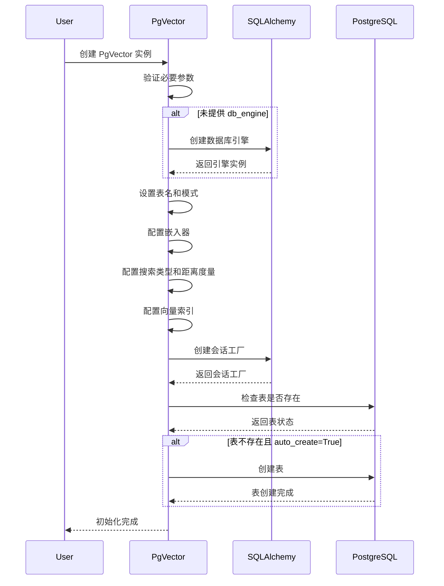
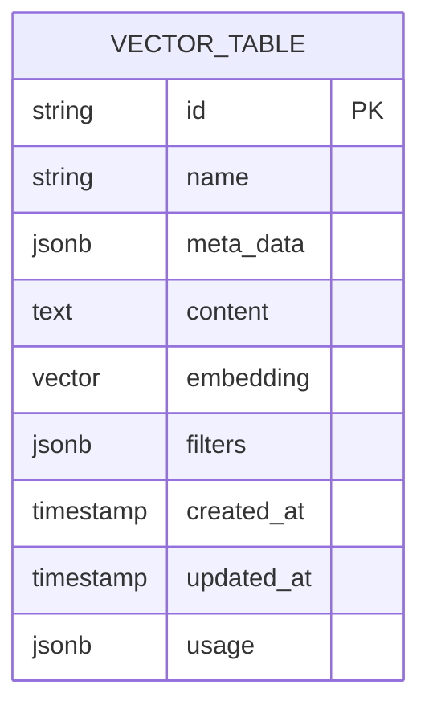

# PgVector 初始化流程

本文档详细说明 PgVector 类的初始化流程和配置选项。

## 初始化参数

PgVector 类初始化时接受多个参数，用于配置数据库连接、搜索行为和索引优化：

- `table_name`：存储向量数据的表名
- `schema`：数据库模式名称（默认为 "ai"）
- `db_url` 或 `db_engine`：数据库连接 URL 或 SQLAlchemy 引擎
- `embedder`：用于生成向量嵌入的嵌入器
- `search_type`：搜索类型（向量、关键词或混合）
- `vector_index`：向量索引配置（HNSW 或 IVFFlat）
- `distance`：向量距离度量（余弦、L2 或最大内积）
- 其他配置选项...

## 初始化流程

## 表结构定义

PgVector 在初始化时会定义表结构，包括以下字段：

- `id`：文档唯一标识符
- `name`：文档名称
- `meta_data`：文档元数据（JSON 格式）
- `content`：文档内容
- `embedding`：向量嵌入
- `filters`：过滤条件（JSON 格式）
- `created_at`：创建时间
- `updated_at`：更新时间
- `usage`：使用统计（JSON 格式）

## 索引配置

PgVector 支持两种向量索引类型：

1. **HNSW（分层可导航小世界）**：
   - `m`：每个节点的最大连接数（默认 16）
   - `ef_search`：搜索时考虑的候选数量（默认 5）
   - `ef_construction`：构建索引时考虑的候选数量（默认 200）

2. **IVFFlat（倒排文件平面）**：
   - `lists`：聚类中心数量（默认 100）
   - `probes`：搜索时检查的聚类数量（默认 10）
   - `dynamic_lists`：是否动态调整聚类数量（默认 True） 