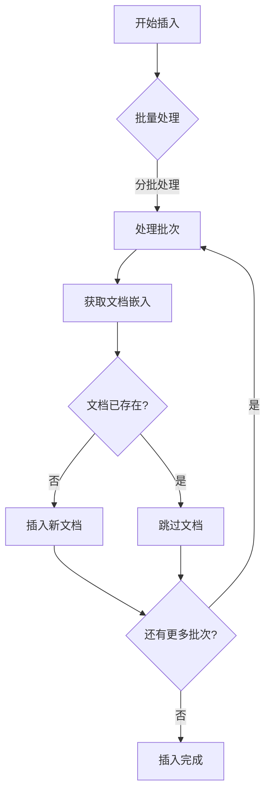
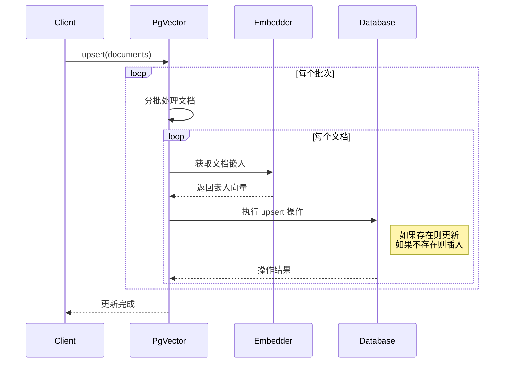
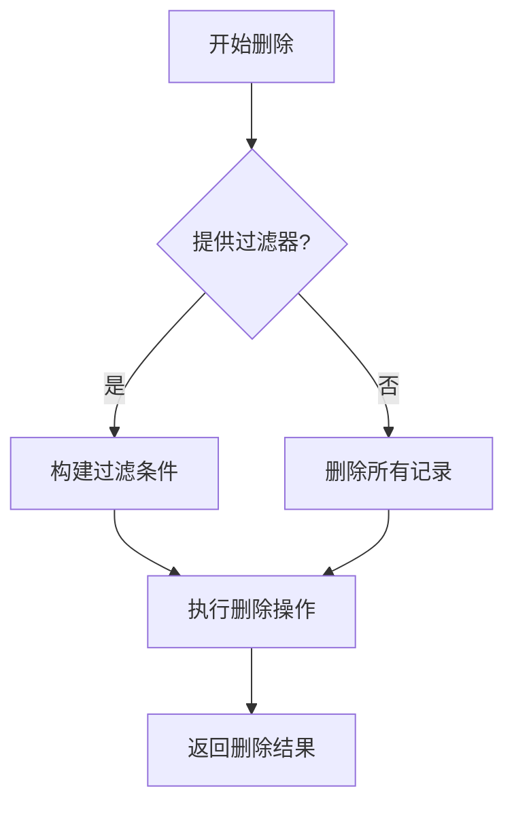
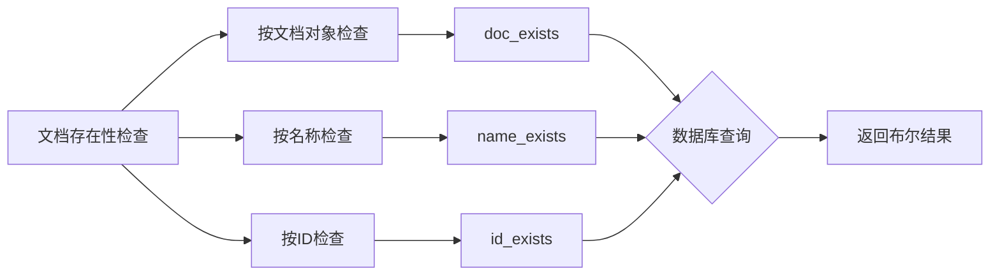

# PgVector 文档操作

本文档详细说明 PgVector 类的文档操作流程，包括插入、更新和删除文档。

## 文档插入流程

### 插入过程详解

1. **批量处理**：文档按批次处理（默认每批 100 个文档）
2. **获取嵌入**：为每个文档内容生成向量嵌入
3. **检查重复**：检查文档是否已存在（基于 ID 或名称）
4. **插入记录**：将文档信息和向量嵌入插入数据库表
5. **错误处理**：出错时回滚当前批次并记录错误

## 文档更新流程（Upsert）

### Upsert 过程详解

1. **检查支持**：确认数据库支持 upsert 操作
2. **批量处理**：文档按批次处理
3. **获取嵌入**：为每个文档内容生成向量嵌入
4. **执行 Upsert**：使用 PostgreSQL 的 `ON CONFLICT DO UPDATE` 语法
5. **应用过滤器**：如果提供了过滤器，则应用到操作中

## 文档删除流程

### 删除过程详解

1. **构建条件**：基于提供的过滤器构建 SQL 删除条件
2. **执行删除**：执行 SQL DELETE 语句
3. **返回结果**：返回是否成功删除记录

## 文档存在性检查

PgVector 提供多种方法检查文档是否存在：

- `doc_exists(document)`：检查文档对象是否存在
- `name_exists(name)`：检查指定名称的文档是否存在
- `id_exists(id)`：检查指定 ID 的文档是否存在 