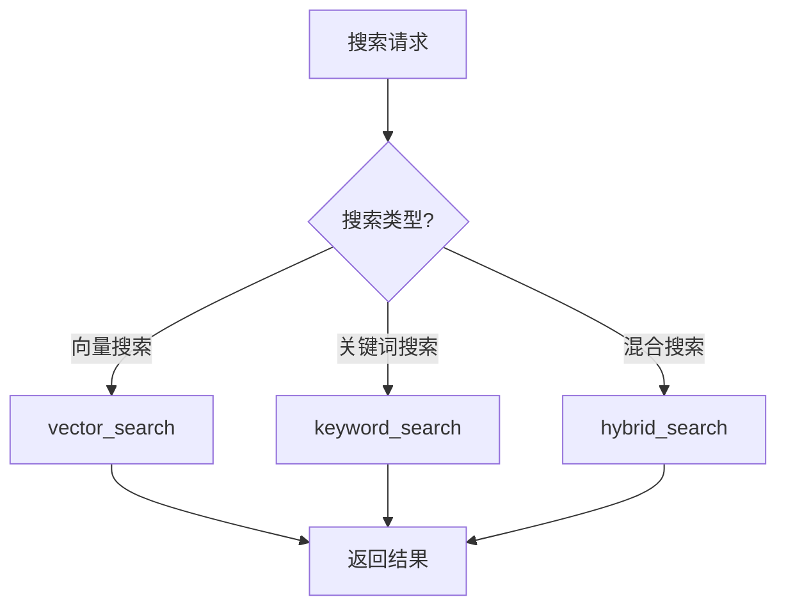
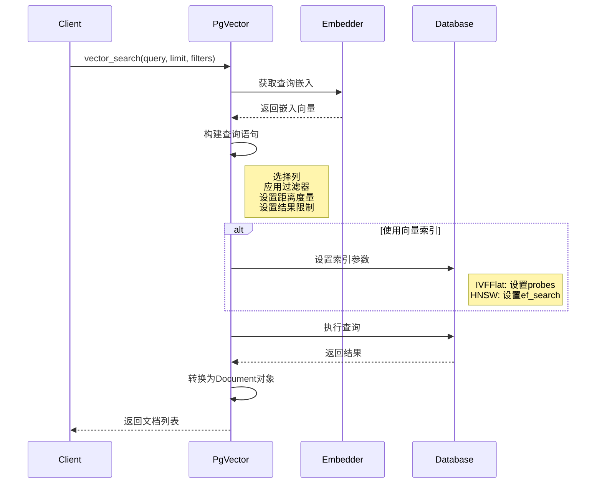
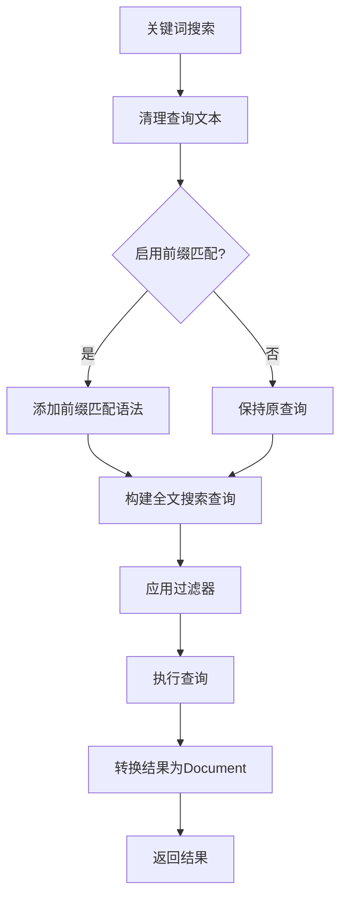
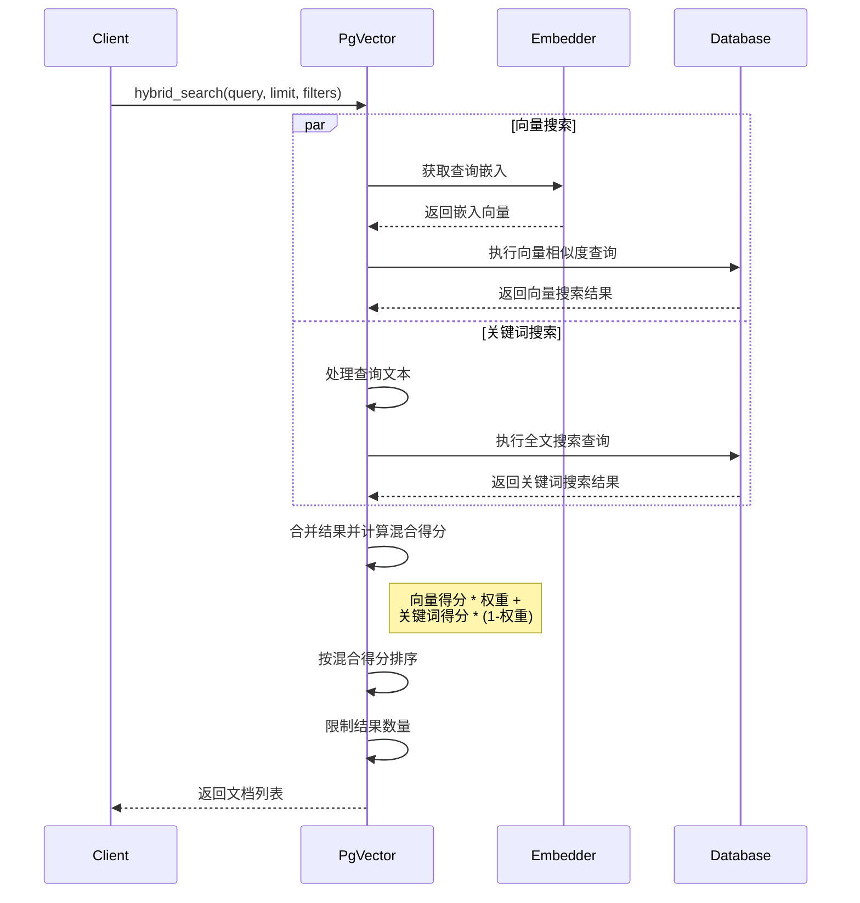
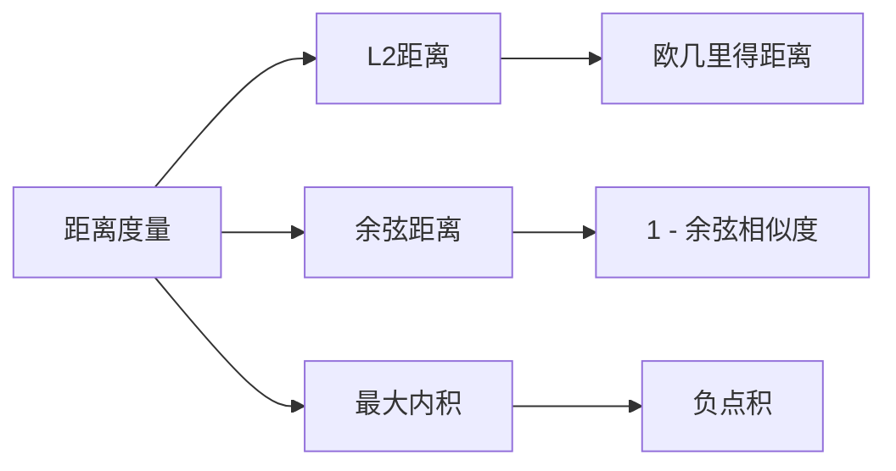

# PgVector 搜索操作

本文档详细说明 PgVector 类的搜索操作流程，包括向量搜索、关键词搜索和混合搜索。

## 搜索类型概述

PgVector 支持三种搜索类型：

1. **向量搜索**：基于向量相似度的搜索
2. **关键词搜索**：基于全文检索的搜索
3. **混合搜索**：结合向量相似度和全文检索的搜索

## 向量搜索流程

### 向量搜索过程详解

1. **获取查询嵌入**：将查询文本转换为向量嵌入
2. **构建查询语句**：
   - 选择需要的列
   - 应用过滤器（如果提供）
   - 根据距离度量（L2、余弦、最大内积）排序
   - 限制结果数量
3. **设置索引参数**：根据索引类型设置搜索参数
4. **执行查询**：执行 SQL 查询并获取结果
5. **处理结果**：将数据库结果转换为 Document 对象列表

## 关键词搜索流程

### 关键词搜索过程详解

1. **清理查询文本**：处理特殊字符和格式
2. **前缀匹配处理**：如果启用前缀匹配，添加相应语法
3. **构建全文搜索查询**：使用 PostgreSQL 的 `to_tsquery` 和 `ts_rank`
4. **应用过滤器**：如果提供了过滤器，则应用到查询中
5. **执行查询**：执行 SQL 查询并获取结果
6. **处理结果**：将数据库结果转换为 Document 对象列表

## 混合搜索流程

### 混合搜索过程详解

1. **并行执行搜索**：
   - 执行向量相似度搜索
   - 执行全文关键词搜索
2. **合并结果**：将两种搜索结果合并
3. **计算混合得分**：
   - 向量得分 × 向量权重
   - 关键词得分 × (1 - 向量权重)
4. **排序和限制**：按混合得分排序并限制结果数量
5. **返回结果**：返回排序后的 Document 对象列表

## 距离度量选项

PgVector 支持三种向量距离度量：

1. **L2 距离**：欧几里得距离，适用于欧几里得空间中的向量
2. **余弦距离**：1 减去余弦相似度，适用于方向相似性
3. **最大内积**：负点积，适用于大小和方向都重要的情况 