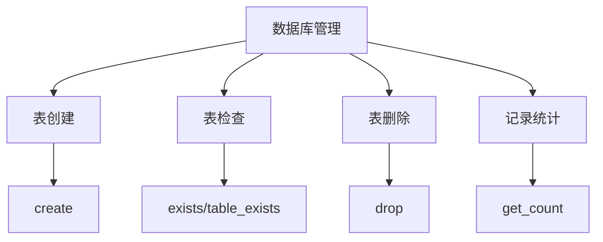
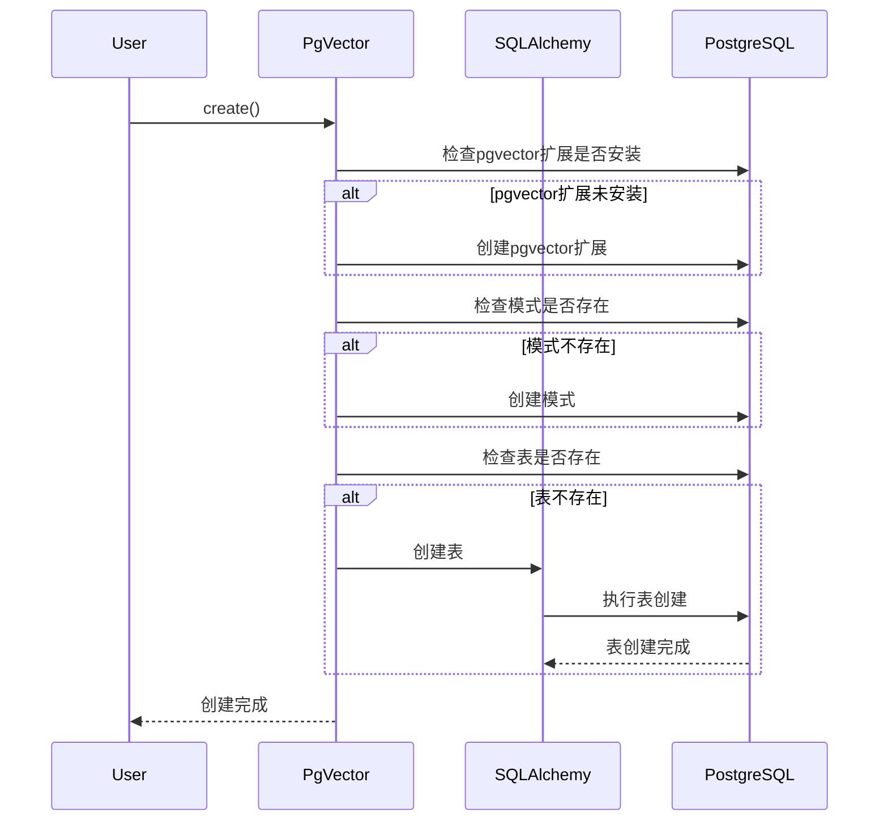
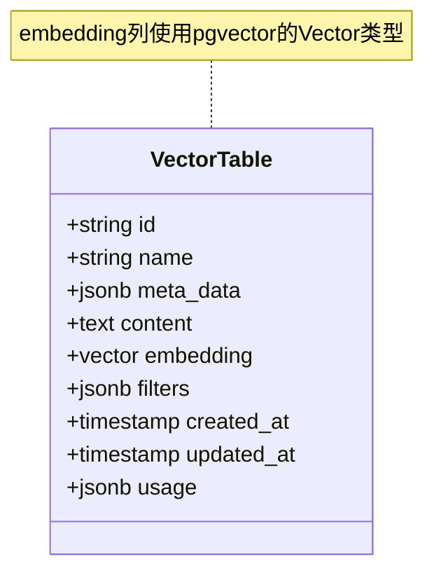
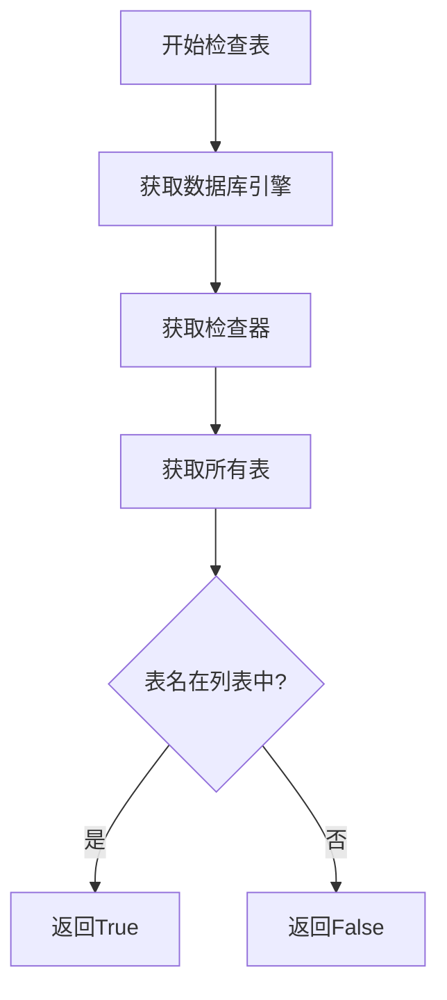
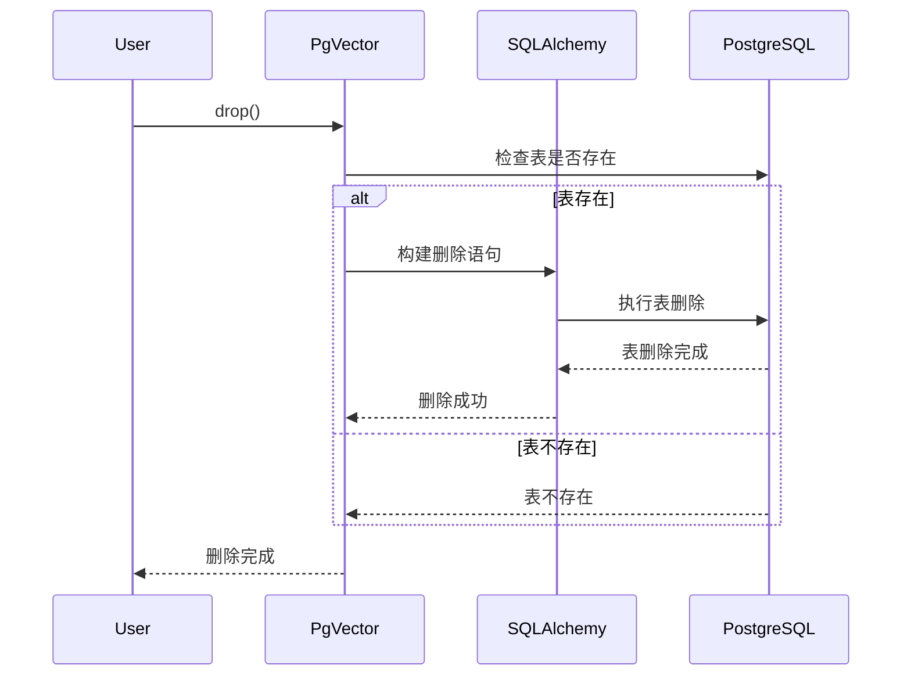
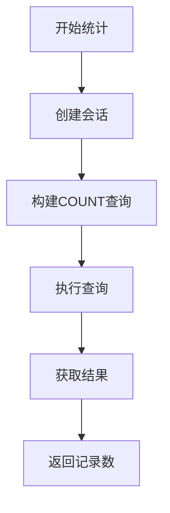
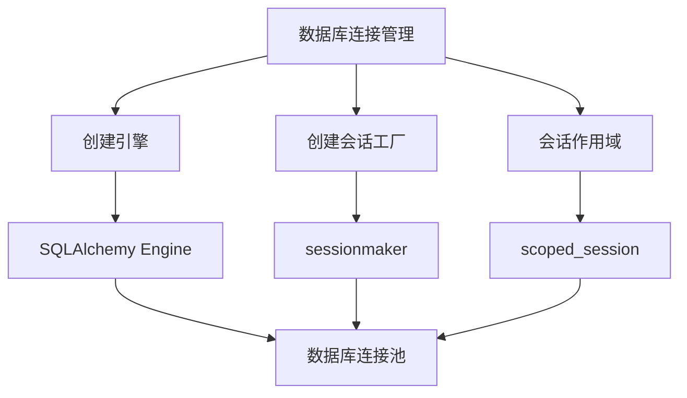

# PgVector 数据库管理

本文档详细说明 PgVector 类的数据库管理功能，包括表创建、检查和删除。

## 表管理流程概述

## 表创建流程

### 表创建详解

1. **检查扩展**：确保 pgvector 扩展已安装
2. **检查模式**：确保指定的模式存在
3. **定义表结构**：
   - 定义主键、列类型和约束
   - 设置向量列的维度
4. **创建表**：使用 SQLAlchemy 创建表
5. **错误处理**：处理创建过程中的错误

## 表结构定义

## 表检查流程

### 表检查详解

1. **获取引擎**：获取 SQLAlchemy 数据库引擎
2. **创建检查器**：使用 `inspect` 创建数据库检查器
3. **获取表列表**：获取指定模式中的所有表
4. **检查表名**：检查目标表名是否在列表中
5. **返回结果**：返回表是否存在的布尔值

## 表删除流程

### 表删除详解

1. **检查表存在性**：确认表是否存在
2. **构建删除语句**：构建 SQL DROP TABLE 语句
3. **执行删除**：执行表删除操作
4. **错误处理**：处理删除过程中的错误

## 记录统计流程

### 记录统计详解

1. **创建会话**：创建数据库会话
2. **构建查询**：构建 SQL COUNT 查询
3. **执行查询**：执行查询并获取结果
4. **处理结果**：将结果转换为整数
5. **错误处理**：处理查询过程中的错误

## 数据库连接管理

### 连接管理详解

1. **引擎创建**：使用 `create_engine` 创建数据库引擎
2. **会话工厂**：使用 `sessionmaker` 创建会话工厂
3. **会话作用域**：使用 `scoped_session` 管理会话作用域
4. **连接池管理**：SQLAlchemy 自动管理连接池
5. **事务管理**：使用 `with session.begin()` 管理事务 